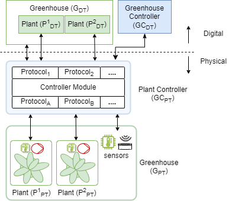

# Plant Controllers

This is a project to develop edge controller and digital twin for plants.
The long-term goal is to realise the vision illustrated in the figure.

We are in the early stages of development. There is one version of
edge controller (named plant controller) available for general use.
Please see the [code](pt/controller_1/README.md) and
[docs](docs/pt/controller_1/assembly/ASSEMBLE.md) for recreating
the setup.

## :rocket: Install and Use

Please use the latest release available on the
[releases page](https://github.com/INTO-CPS-Association/plant-controller/releases)
to install and use the software.

## :hammer_and_wrench: Developers

The immediate development goals are to

1. Improve the code quality of [controller-1](pt/controller_1/controller-1.py)
1. Make the plant controller inter-operable with Greehhouse being developed
   at [UIO, Norway](https://github.com/N-essuno/greenhouse_twin_project)
1. Develop a digital twin for the edge device on which the controller is hosted
1. Develop a digital twin for the soil of the plants

Your feedback is valuable in improving the project. Please open
[an issue](https://github.com/INTO-CPS-Association/plant-controller/issues/new)
if you find problems or have suggestions for potential improvements. Thanks.

## :balance_scale: License

This software is owned by
[The INTO-CPS Association](https://into-cps.org/)
and is available under [the INTO-CPS License](./LICENSE.md).

Please see [third-party](docs/third-party.md) for details of
the third-party software included in the DTaaS.