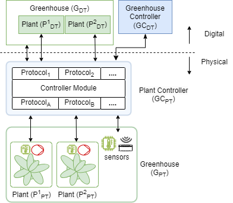

# Plant Controllers

This is a project to develop edge controller and digital twin for plants.
The long-term goal is to realise the vision illustrated in the figure.



The current version allows for digital twin development for specifically the
connected plants.

Documentation for current and previous versions of the Plant Controller can be
found online [Here](https://into-cps-association.github.io/plant-controller/).

## :rocket: Install and Use

To get up an running follow the [Quick Start Guide](https://into-cps-association.github.io/plant-controller/pt/controller_3/setup/quick_start/).

## :hammer_and_wrench: Developers

Detailed documentation of the system can be found [here](https://into-cps-association.github.io/plant-controller/pt/controller_3/documentation/).

To build the documentation locally install python and the requirements in [`requirements-docs.txt`](./requirements-docs.txt), then run
```bash
python ./scripts/gen_api_pages.py
zensical serve
```
The docummentation should then be available at [http://localhost:8000](http://localhost:8000).

Your feedback is valuable in improving the project. Please open
[an issue](https://github.com/INTO-CPS-Association/plant-controller/issues/new)
if you find problems or have suggestions for potential improvements. Thanks.

## :balance_scale: License

This software is owned by
[The INTO-CPS Association](https://into-cps.org/)
and is available under [the INTO-CPS License](./LICENSE.md).

Please see [third-party](docs/third-party.md) for details of
the third-party software included in the DTaaS.