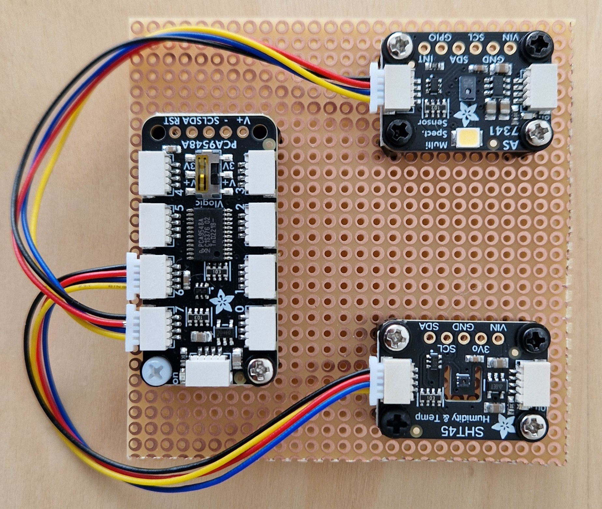
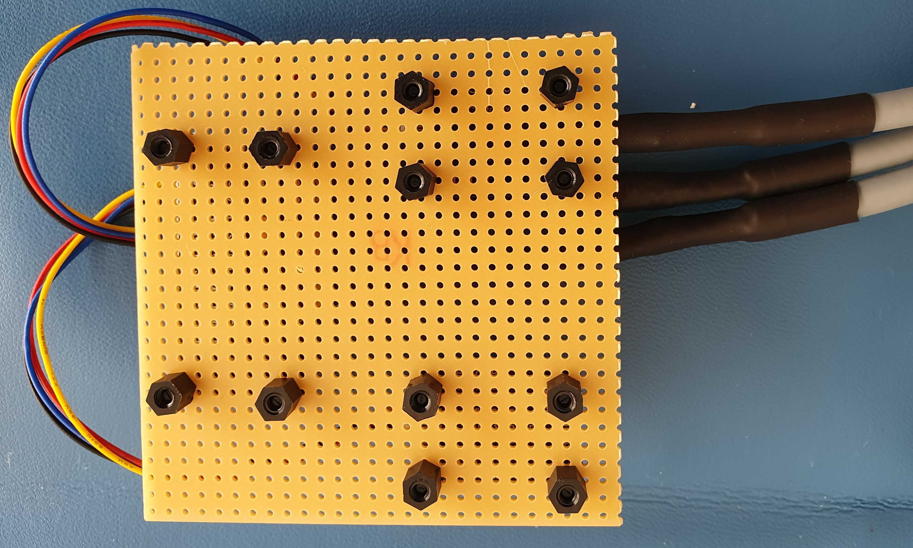
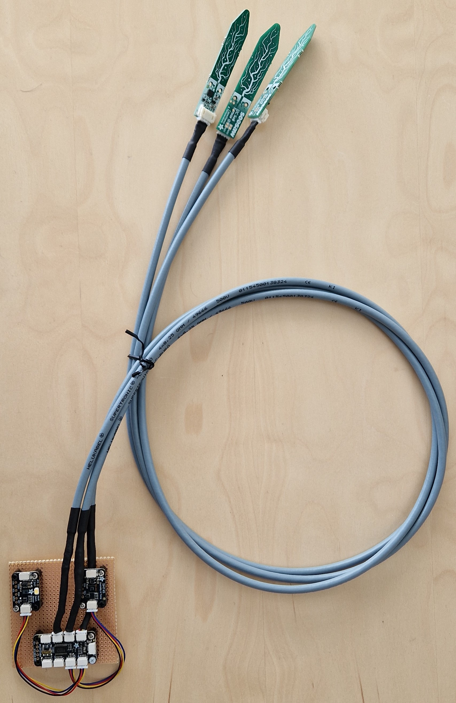

# Assembly Instruction

This instruction shows how to build the example plants controller. It is a mockup representation of an edge controller for a physical green house.

## Parts list

Please see the complete [parts list](../PARTS.md).
If you are not familiar with the hardware components used in this prototype,
please see [their](../../parts/hardware-pictures/parts-pictures.md).

## Step-by-step Instructions

Follow this step-by-step guide to build the plant controller prototype.
The guide is divided into 5 parts. Each part builds a component of
the controller. Each step of the assembly is accompanied by a picture.

### Part 1: Building the Sensor Plate

In this step the sensor plate containing with three components is build.
The plate contains two sensors and a multiplexer, namely

1. Adafruit [SHT45 temperature and humidity sensor](../../parts/hardware-pictures/STH45-adafruit.jpg).
1. Adafruit [8-to-1 mulitplexer](../../parts/hardware-pictures/PCA9548-adafruit.jpg).
1. The sensors are mounted on the breadboard uisng the pre-drilled holes.


1.1. Mount the SHT45 sensor on the breadboard using 4x M2.5 washer, 4x M2.5*8mm screws, 4x M2.5 spacers and 4x M2.5 studs. Ensure that the spacer is on the underside. See [picture 1](#sensor-plate-side-view).

1.2 Mount the AS7341 sensor on the breadboard using 4x M2.5 washer, 4x M2.5*8mm screws, 4x M2.5 spacers and 4x M2.5 studs. Ensure that the spacer is on the underside. See [picture 1](#sensor-plate-side-view).

1.3 Mount the Adafruit PCA9548A 1-to-8 I2C Multiplexer on the breadboard using 2x M2.5 washer, 2x M2.5*8mm screws, 4x M2.5 spacers and 4x M2.5 studs. Ensure that the spacer is on the underside. See [picture 1](#sensor-plate-side-view).

1.4 Connect the SHT45 sensor to the Adafruit PCA9548A 1-to-8 I2C Multiplexer using the I2C cables (port-6). See (A) and (B) on [picture 2](#sensor-plate-top-view).

1.5 Connect the AS7341 sensor to the Adafruit PCA9548A 1-to-8 I2C Multiplexer using the I2C cables (port 7). See (C) and (D) on [picture 2](#sensor-plate-top-view).


The built sensor plate should look like this:





1.6 Connect the soil sensors to the Adafruit PCA9548A 1-to-8 I2C Multiplexer using the Stemma to StemmaQT cables into ports: 0, 1 and 2 on the Adefruit Multiplexer. See (E), (F), and (G) on [picture 2](#sensor-plate-top-view).


Picture of the connected sensors and their respective ports:


### Part 3: Building the power board

In this step the power board is assembled. The power board is used to power the pumps and gets powered by the 12v power supply.

The power board should look like this:

###### Power board top view:


Picture 4.

###### Power board zoom detail view:


Picture 5.

###### Power board DF detail view:


Picture 6.

3.1 Connect the pumps to the Automation Hat. Red into the COM from the pumps and the black into the DF 62 wire connector from the pumps to be grounded and powored by the 12v power supply. Use 3x electric wire to connect from the DF 62 wire connector to NO on the Automation Hat.

A diagram illustrating the connection of pumps to the Automation Hat, can be seen on [Figure 1](#power-board-electrical-schematic). To see how this looks like see [picture 5](#power-board-zoom-detail-view).

View of the DF 62 wire connector with red and black wires connected to the Automation Hat can be seen on [picture 6](#power-board-df-detail-view).

3.2 Connect the DF 62 wire connector to the power suppler using DC barrel Plug connector like on [picture 6](#power-board-df-detail-view) and [picture 4](#power-board-top-view).

3.3 Connect the Automation Hat and pumps to the 12v power supply.

### Part 4: Install Raspeberry Pi OS

4.1 Download the [Raspberry Pi Imager](https://www.raspberrypi.com/software/).

4.2 Install the Raspberry Pi OS on the Raspberry Pi using the [Raspberry Pi Imager](https://www.raspberrypi.com/software/). 

4.3 Insert 16g SD into PC and Open the Raspberry Pi Imager and select the Raspberry Pi OS software and the SD card to install the software on. Press next and follow the steps.

What to select:


Picture 7.
(A) RASPBERRY PI 3 (If you are using another Raspberry Pi, select the corresponding one)
(B) RASPBERRY PI OS (64-bit)
(C) Choose the 16g SD card

### Part 5: Install the required software

5.1 Download the latest [release](https://github.com/INTO-CPS-Association/example-plants/releases/tag/greenhouse-1_v0.1) of the example plant software.

5.2 Unzip the downloaded file and do the following commands in the terminal:

```bash
    cd example-plants-greenhouse-1_v0.1/pt/green_house_1
    python -m venv green_house-venv
    source green_house-venv/bin/activate
    pip install -r requirements.txt
```

5.3 To start the plant physical twin run the following command:

```bash
    python green_house_1.py
```

### Part 6: Assemble components

###### Assemble top view:


Picture 8.
###### Automation hat mounted on Raspberry Pi view:


Picture 9.

###### Pin connections view:


Picture 10.

5.1 Mount the Automation Hat on the Raspberry Pi using the T GPIO stackable header and 4x M2.5*6mm spacer, 4x M2.5*6mm stud, 4x M2.5*8mm stud, 4x M2.5 washer, and 4x M2.5*8mm screw. See [picture 9](#automation-hat-mounted-on-raspberry-pi-view).

5.2 Connect the sensor plate to the Raspberry Pi using the StemmaQT connector to Female pins cable (Pints - 1,3,5,9). See [picture 10](#pin-connections-view).

After connecting the sensor plate to the Raspberry Pi the example green house plant physical twin should look like [picture 8](#assemble-top-view).

### Part 7: Powering the system

5.1 Connect the 12v power supply to the Automation Hat and pumps using the DC barrel plug connector. Set the power supply to 3v. You may increase this if needed, but not above 12v. See [picture 4](#top-view).

5.2 Plug the power cable into the rapsberry pi. 

### Electrical schematic


Figure 1.