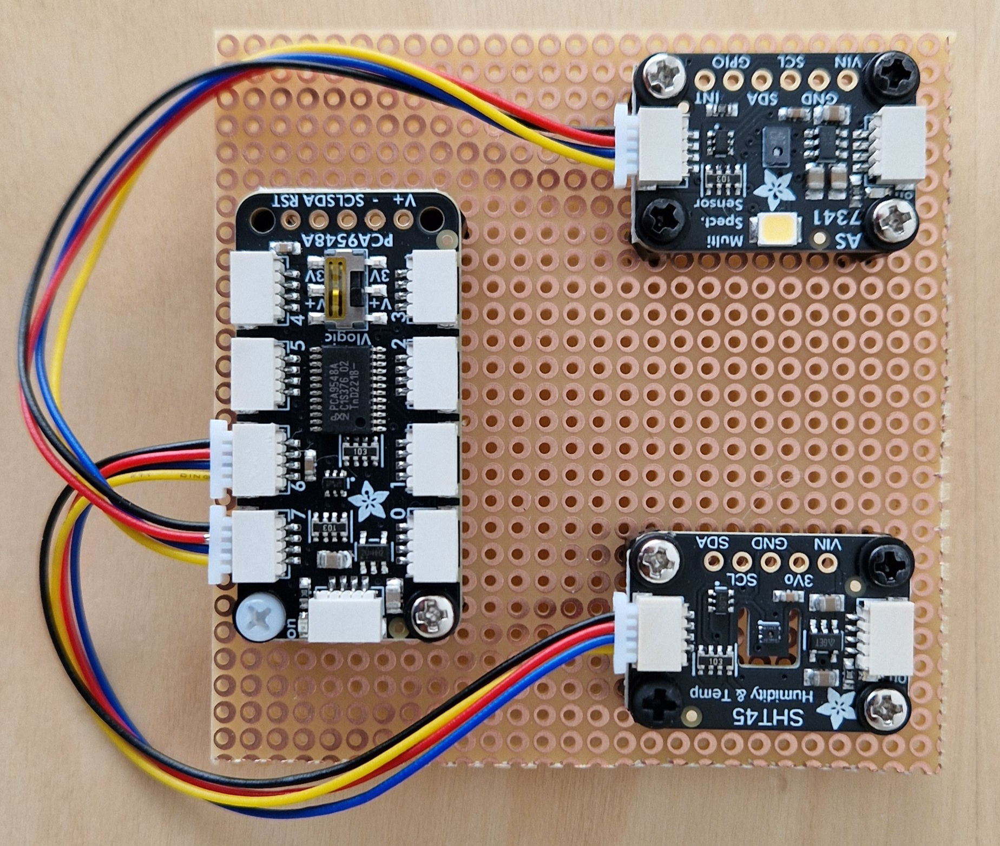
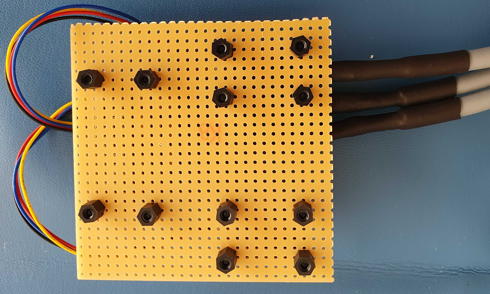
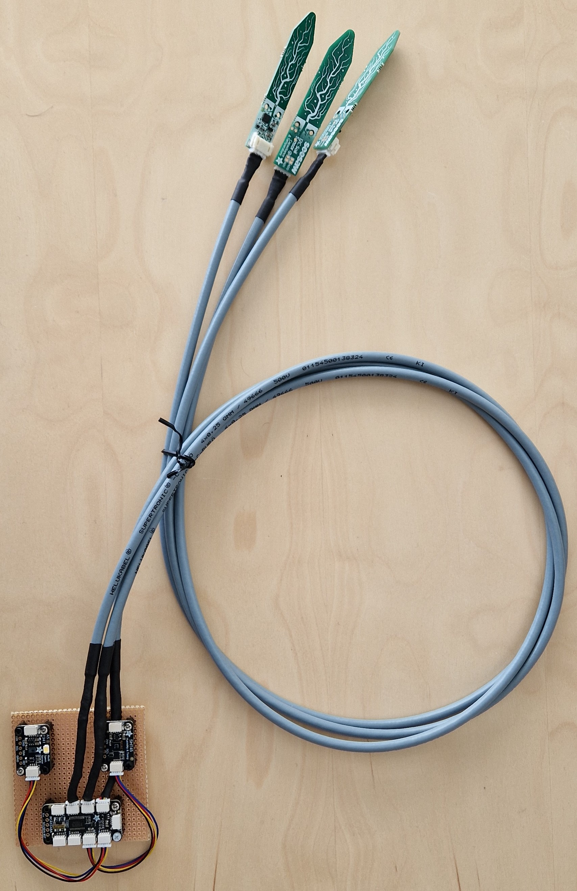
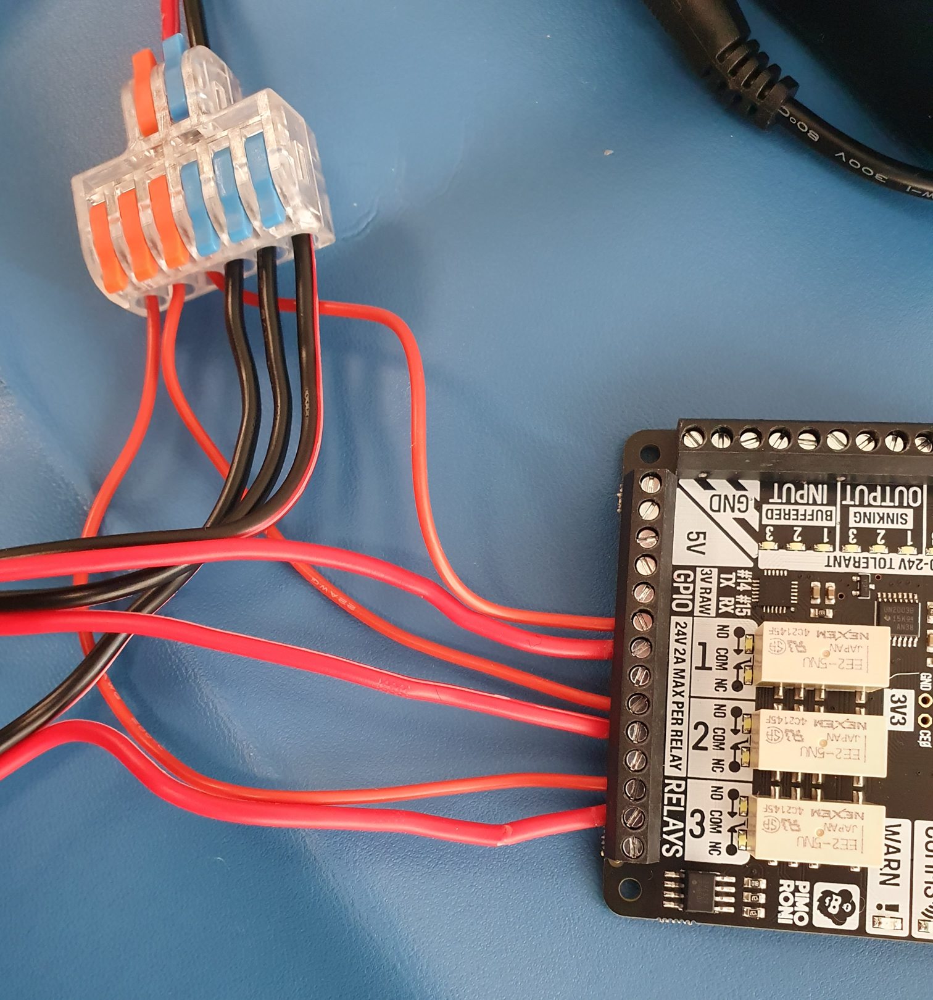
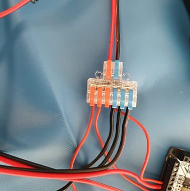
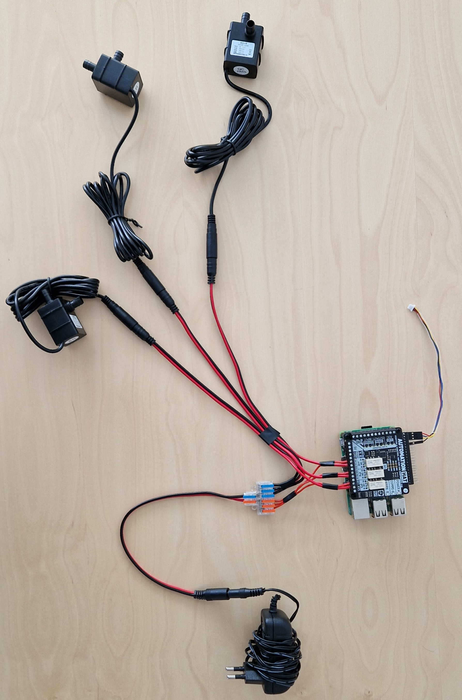
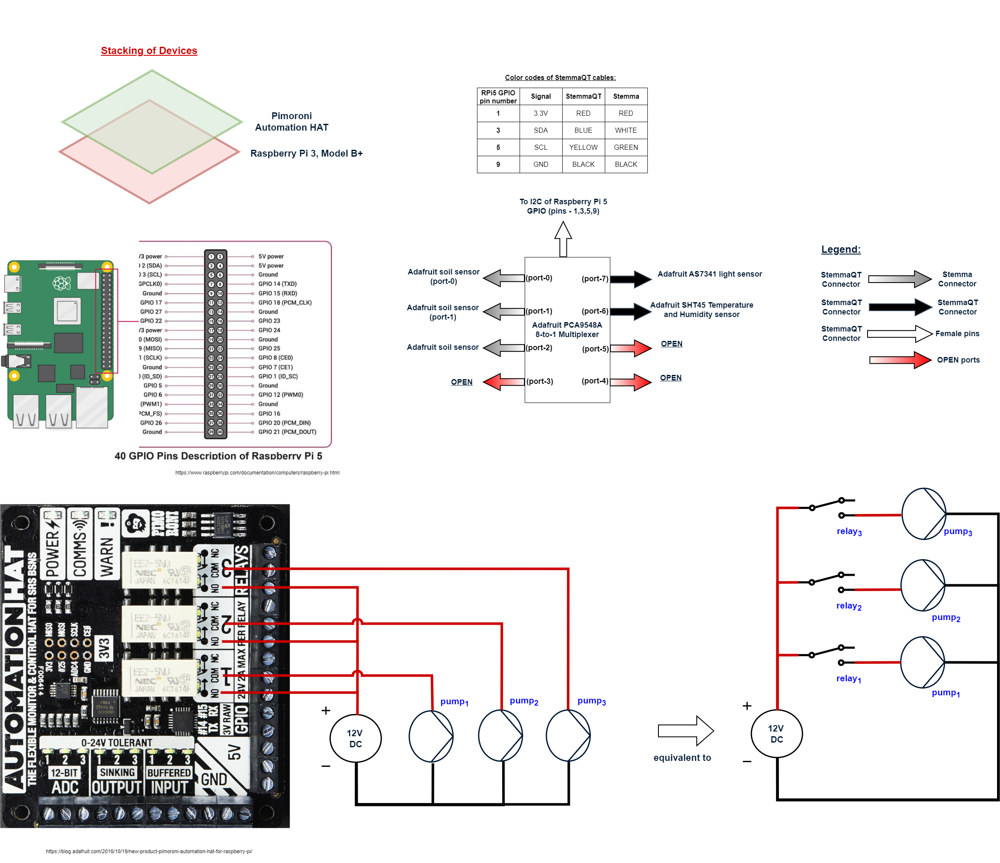
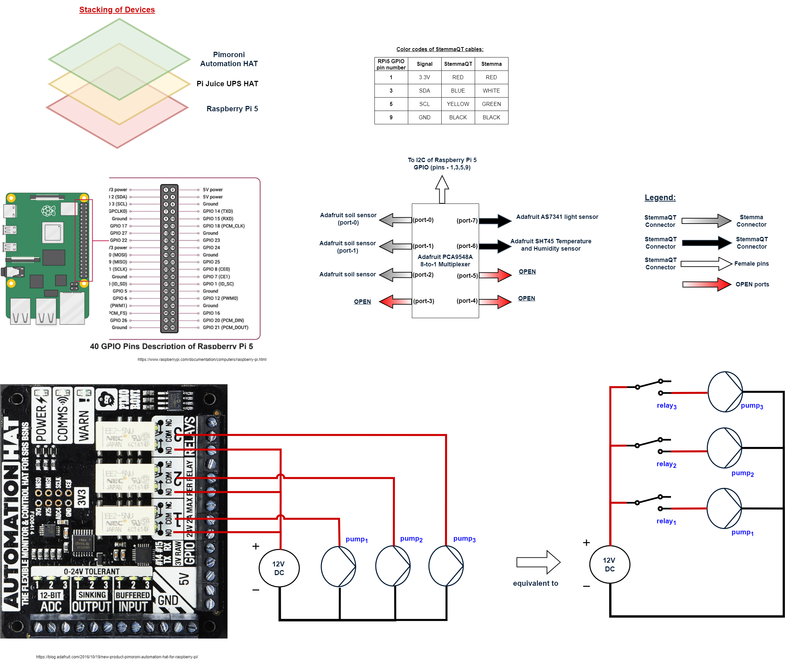
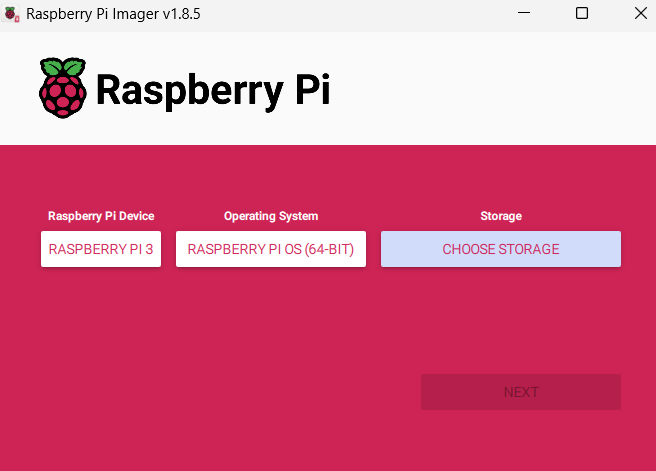
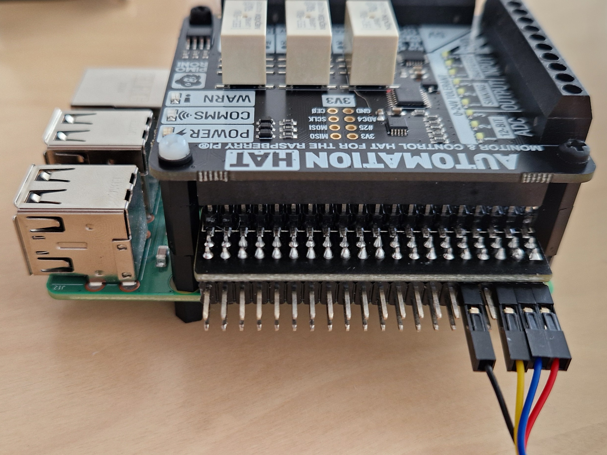

# Assembly Instruction

This instruction shows how to build the example plants controller.
It is a prototype of an edge controller for
a physical green house. A complete physical prototype looks like this.


The following tutorial helps with assembling of the prototype.

## Parts list

Please see the complete [parts list](../PARTS.md).
If you are not familiar with the hardware components used in this prototype,
please see
[their pictures](../../parts/hardware-pictures/parts-pictures.md).

## Step-by-step Instructions

Follow this step-by-step guide to build the plant controller prototype.
The guide is divided into 6 parts. Each part builds a component of
the controller. Each step of the assembly is accompanied by a picture.

### Part 1: Building the Sensor Plate

In this step the sensor plate containing with three components is build.
The plate contains two sensors and a multiplexer, namely

1. Adafruit [SHT45 temperature and humidity sensor](../../parts/hardware-pictures/STH45-adafruit.jpg).
1. Adafruit [AS7341 light sensor](../../parts/hardware-pictures/AS7341-adafruit.jpg)
1. Adafruit [8-to-1 mulitplexer](../../parts/hardware-pictures/PCA9548-adafruit.jpg).
1. The sensors are mounted on the breadboard uisng the pre-drilled holes.

Do the following assembly steps:

1. Mount the SHT45 sensor on the breadboard using 4x M2.5 washer,
    4x M2.5*8mm screws, 4x M2.5 spacers and 4x M2.5 studs. Ensure that
    the spacer is on the underside. See [picture 1](#sensor-plate-top-view).

1. Mount the AS7341 sensor on the breadboard using 4x M2.5 washer, 4x M2.5*8mm screws,
   4x M2.5 spacers and 4x M2.5 studs. Ensure that the spacer is on the underside.
   See [picture 1](#sensor-plate-top-view) and [picture 2](#sensor-plate-bottom-view).

1. Mount the Adafruit PCA9548A 1-to-8 I2C Multiplexer on the breadboard using
   2x M2.5 washer, 2x M2.5*8mm screws, 4x M2.5 spacers and 4x M2.5 studs.
   Ensure that the spacer is on the underside. See
   [picture 1](#sensor-plate-top-view) and [picture 2](#sensor-plate-bottom-view).

1. Connect the SHT45 sensor to the Adafruit PCA9548A 1-to-8 I2C Multiplexer
   using the I2C cables (port-6). See [picture 1](#sensor-plate-top-view).

1. Connect the AS7341 sensor to the Adafruit PCA9548A 1-to-8 I2C Multiplexer
   using the I2C cables (port 7). See [picture 1](#sensor-plate-top-view).

   <!-- markdownlint-disable MD013 -->
   <a id="sensor-plate-top-view"></a>

   The built sensor plate should look like this:
   

   <!-- markdownlint-disable MD013 -->
   <a id="sensor-plate-bottom-view"></a>

   

1. Connect the soil sensors to the Adafruit PCA9548A 1-to-8 I2C Multiplexer
   using the Stemma to StemmaQT cables into ports: 0, 1 and 2 on
   the Adafruit Multiplexer.
   See [picture 3](#complete-view-of-the-sensor-plate).

   <!-- markdownlint-disable MD013 -->
   <a id="complete-view-of-the-sensor-plate"></a>

   Picture of the connected sensors and their respective ports:
   

### Part 2: Building the power board

In this step the power board is assembled. The power board is used to power
the pumps and gets powered by the 12v power supply. The power board build
contains the following components:

1. DF 62 [cable connector](../../parts/hardware-pictures/df-2-6-out-lever-cable-connector.jpg).
1. Male Female [DC Power Pigtail Cable](../../parts/hardware-pictures/male-female-power-pigtail-cable.jpg).
1. 12V variable power supply, like
   [this](../../parts/hardware-pictures/adjustable-power-supply-dc.jpg)
   or standard 12V wall plug power supply.
1. 12V submersible water pump, like [this](../../parts/hardware-pictures/12v-pump.jpg).
1. [Automation HAT](../../parts/hardware-pictures/automation-hat.jpg).
1. Electric wire.

3.1 Connect the pumps to the Automation HAT and DF 62 cable connector
    using barrel plug to pigtail connector.
    **Red** from the pumps goes into the **COM** and the **black** from
    the pumps goes into the DF 62 cable connector to be grounded and powered
    by the 12V power supply. Use 3x electric wire to connect the DF 62
    wire connector to NO on the Automation Hat.
    See [picture 4](#power-board-zoom-detail-view). <!-- markdownlint-disable MD013 -->
    <a id="power-board-zoom-detail-view"></a>
    

3.2 Connect the DF 62 cable connector to the power suppler using DC barrel
    Plug connector like on
    [picture 5](#power-board-detail-df).<!-- markdownlint-disable MD013 -->
    <a id="power-board-detail-df"></a>
    

3.3 Connect the Automation HAT and pumps to the 12V power supply.
    This should look like [picture 6](#power-board-top-view).
    <!-- markdownlint-disable MD013 -->
    <a id="power-board-top-view"></a>
    

A diagram illustrating the connection between pumps, Automation HAT,
and power supply can be seen
[Figure 1](#pt-electrical-schematic)<!-- markdownlint-disable MD013 -->
<a id="pt-electrical-schematic-v0.2.0"></a>


An alternative is to use Raspberry Pi 5 with Pi Juice UPS HAT can also
be assembled. Please see
[Figure 2](#pt-electrical-schematic)<!-- markdownlint-disable MD013 -->
<a id="pt-electrical-schematic-v0.1.2"></a>


### Part 3: Install Raspeberry Pi OS

In this step is installation of the raspberry Pi
Operating System (OS) shown. To do this the following components
and software needed:

1. Raspberry [Pi 5 or 3 B+](../../parts/hardware-pictures/Raspberry-Pi-3-Model-BPlus.jpg).
1. 16GB SD card.
1. Raspberry Pi [Imager software](https://www.raspberrypi.com/software/).
1. USB SD card reader.
1. USB keyboard and mouse.
1. HDMI cable and monitor.
1. Power supply for the Raspberry Pi.

4.1 Download the [Raspberry Pi Imager](https://www.raspberrypi.com/software/).

4.2 Install the Raspberry Pi OS on the Raspberry Pi using
    the Raspberry Pi Imager.

4.3 Insert 16GB SD into PC and Open the Raspberry Pi Imager. Then select
    the Raspberry Pi OS software and the SD card to install the software on.
    Press next and follow the steps. See [picture 7](#raspberry-pi-imager).
    <!-- markdownlint-disable MD013 -->
    <a id="raspberry-pi-imager"></a>
    
    Specifically pick the following options:

- RASPBERRY PI 3 (If you are using another Raspberry Pi, select
  the corresponding one)
- RASPBERRY PI OS (64-bit)
- Choose the 16GB SD card you inserted into the PC.

4.4 After the installation is done, insert the SD card into the Raspberry Pi
    and boot it up. Remember to connect the Raspberry Pi to the au-gadget
    wifi network in the OS instillation process.

### Part 4: Install the required software

5.1 Download the latest
    [release](https://github.com/INTO-CPS-Association/plant-controller/releases)
    of the example plant software.

5.2 Unzip the downloaded file and do the following commands in the terminal:

   ```bash
   cd example-plants/pt/controller_1
   python -m venv controller-1-venv
   source controller-1-venv/bin/activate
   pip install -r requirements.txt
   ```

5.3 To start the PT plant run the following command:

   ```bash
   python controller-1.py
   ```

### Part 5: Assemble components

In this step are all of the compnents used from previoues steps to build
the complete PT plant mockup. This involve the three components built
in the previous steps, namely:

1. Raspberry [Pi 5 / 3 B+](../../parts/hardware-pictures/Raspberry-Pi-3-Model-BPlus.jpg)
1. Sensor plate [with sensors connected](pictures/sensors.jpg)
1. Power [board](pictures/motors.jpg)

5.1 Mount the Automation Hat on the Raspberry Pi using the T GPIO stackable
    header using 4x M2.5*6mm spacer, 4x M2.5*6mm stud,
    4x M2.5*8mm stud, 4x M2.5 washer, and 4x M2.5*8mm screw.
    See [picture 8](#pin-connections-view).

5.2 Connect the sensor plate to the Raspberry Pi using the StemmaQT
    connector to Female pins cable (Pints - 1,3,5,9).
    See [picture 8](#pin-connections-view).
    <!-- markdownlint-disable MD013 -->
    <a id="pin-connections-view"></a>
    

After mounting the Automation HAT and connecting the sensor plate to
the Raspberry Pi the example plant PT should look like
[picture 8](#assemble-top-view).

<!-- markdownlint-disable MD013 -->
<a id="assemble-top-view"></a>


## Part 6: InfluxDB and setup

In this step is a guide on how to setup the *InfluxDB* database for
the example plant controller. Specifically creating a new bucket for data
to be stored in and creating a token used to read and write to the bucket.
Measerument from the mockup is stored in the InfluxDB databse, to be used
by the DT and Grafana.

1. Host a local InfluxDB database and login using your credentials.
   The <https://influxdb.foo.com> is used as an example URL to illustrate
   the next steps.

1. After login in, click on **View more** on the **Get Started** page.
   This should take you to the **Load Data** page.

1. Click on **Buckets** the menu bar and click on the **Create Bucket** button.
   Give the bucket a meaningful name.

1. Next create the API token used to read and write to the bucket
   just created. Click on **API Tokens** in the menu bar and click on
   the **Create API Token** button and choose **Costum API Token**.

1. Then selct the bucket you just created and select the **Read/Write**
   permission. This will create a token that can be used to read and
   write to the bucket.

1. Copy the token and then replace `xxxx`and `name-of-bucket` in
   the `controller_1.py` script with the token and name of bucket
   you just created:

   ```python
   org = "your-organization-name"
   url = "https://influxdb.foo.com"
   token="xxxx"
    
   write_client = influxdb_client.InfluxDBClient(url=url, token=token, org=org)
    
   bucket="name-of-bucket"
   ```

For more information about InfluxDB, please see
the [InfluxDB Documentation](https://docs.influxdata.com/).
