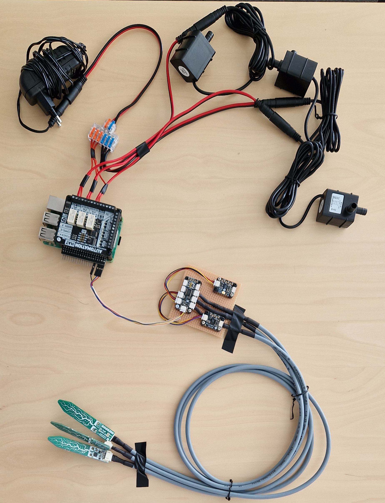

# Assembly Instruction

This instruction shows how to build the example plants controller. It is a mockup representation of an edge controller for a physical green house.

## Parts list

Please see the complete [parts list](../PARTS.md).
If you are not familiar with the hardware components used in this prototype,
please see [their](../../parts/hardware-pictures/parts-pictures.md).

## Step-by-step Instructions

Follow this step-by-step guide to build the plant controller prototype.
The guide is divided into 6 parts. Each part builds a component of
the controller. Each step of the assembly is accompanied by a picture. 

### Part 1: Building the Sensor Plate

In this step the sensor plate containing with three components is build.
The plate contains two sensors and a multiplexer, namely

1. Adafruit [SHT45 temperature and humidity sensor](../../parts/hardware-pictures/STH45-adafruit.jpg).
1. Adafruit [8-to-1 mulitplexer](../../parts/hardware-pictures/PCA9548-adafruit.jpg).
1. The sensors are mounted on the breadboard uisng the pre-drilled holes.


1.1. Mount the SHT45 sensor on the breadboard using 4x M2.5 washer, 4x M2.5*8mm screws, 4x M2.5 spacers and 4x M2.5 studs. Ensure that the spacer is on the underside. See [picture 1](#sensor-plate-top-view).

1.2 Mount the AS7341 sensor on the breadboard using 4x M2.5 washer, 4x M2.5*8mm screws, 4x M2.5 spacers and 4x M2.5 studs. Ensure that the spacer is on the underside. See [picture 1](#sensor-plate-top-view) and [picture 2](#sensor-plate-bottom-view).

1.3 Mount the Adafruit PCA9548A 1-to-8 I2C Multiplexer on the breadboard using 2x M2.5 washer, 2x M2.5*8mm screws, 4x M2.5 spacers and 4x M2.5 studs. Ensure that the spacer is on the underside. See [picture 1](#sensor-plate-top-view) and [picture 2](#sensor-plate-bottom-view).

1.4 Connect the SHT45 sensor to the Adafruit PCA9548A 1-to-8 I2C Multiplexer using the I2C cables (port-6). See [picture 1](#sensor-plate-top-view).

1.5 Connect the AS7341 sensor to the Adafruit PCA9548A 1-to-8 I2C Multiplexer using the I2C cables (port 7). See [picture 1](#sensor-plate-top-view).
<a id="sensor-plate-top-view"></a>
The built sensor plate should look like this:

<a id="sensor-plate-bottom-view"></a>


1.6 Connect the soil sensors to the Adafruit PCA9548A 1-to-8 I2C Multiplexer using the Stemma to StemmaQT cables into ports: 0, 1 and 2 on the Adefruit Multiplexer. See [picture 3](#complete-view-of-the-sensor-plate).
<a id="complete-view-of-the-sensor-plate"></a>
Picture of the connected sensors and their respective ports: 


### Part 2: Building the power board

In this step the power board is assembled. The power board is used to power the pumps and gets powered by the 12v power supply. The power board build contains the following components:
1. df 62 [cable connector](../../parts/hardware-pictures/df-2-6-out-lever-cable-connector.jpg).
1. Male Female [DC Power Pigtail Cable](../../parts/hardware-pictures/male-female-power-pigtail-cable.jpg).
1. 12v power supply, like [this](../../parts/hardware-pictures/adjustable-power-supply-dc.jpg) or standard 12v wall plug power supply.
1. 12v submersible water pump, like [this](../../parts/hardware-pictures/12v-pump.jpg).
1. Automation [Hat](../../parts/hardware-pictures/automation-hat.jpg).
1. Electric wire.

3.1 Connect the pumps to the Automation Hat and DF 62 cable connector using barrel plug to pigtal connector. 

- 3.1.1 Red into the COM from the pumps and the black into the DF 62 cable connector from the pumps to be grounded and powored by the 12v power supply. Use 3x electric wire to connect the DF 62 wire connector to NO on the Automation Hat. See [picture 4](#power-board-zoom-detail-view). <a id="power-board-zoom-detail-view"></a>


3.2 Connect the DF 62 cable connector to the power suppler using DC barrel Plug connector like on [picture 5](#power-board-detail-df).<a id="power-board-detail-df"></a>


3.3 Connect the Automation Hat and pumps to the 12v power supply. This should look like [picture 6](#power-board-top-view).<a id="power-board-top-view"></a>


A diagram illustrating the connection between pumps, Automation Hat, and power supply can be seen [Figure 1](#pt-electrical-schematic)
<a id="pt-electrical-schematic"></a>


### Part 3: Install Raspeberry Pi OS
In this step is installation of the raspberry Pi Operating System (OS) shown. To do this the following components and software needed:
1. Raspberry [Pi 3 B+](../../parts/hardware-pictures/Raspberry-Pi-3-Model-BPlus.jpg).
1. 16g SD card.
1. Raspberry Pi [Imager software](https://www.raspberrypi.com/software/).
1. USB SD card reader.
1. USB keyboard and mouse.
1. HDMI cable and monitor.
1. Power supply for the Raspberry Pi.


4.1 Download the [Raspberry Pi Imager](https://www.raspberrypi.com/software/).

4.2 Install the Raspberry Pi OS on the Raspberry Pi using the Raspberry Pi Imager. 

4.3 Insert 16g SD into PC and Open the Raspberry Pi Imager. Then select the Raspberry Pi OS software and the SD card to install the software on. Press next and follow the steps. See [picture 7](#raspberry-pi-imager).<a id="raspberry-pi-imager"></a>

Specifically pick the following options: 
- RASPBERRY PI 3 (If you are using another Raspberry Pi, select the corresponding one)
- RASPBERRY PI OS (64-bit)
- Choose the 16g SD card you inserted into the PC.

4.4 After the installation is done, insert the SD card into the Raspberry Pi and boot it up. Remember to connect the Raspberry Pi to the au-gadget wifi network in the OS instillation process.

### Part 4: Install the required software

5.1 Download the latest [release](https://github.com/INTO-CPS-Association/example-plants/releases/tag/greenhouse-1_v0.1) of the example plant software.

5.2 Unzip the downloaded file and do the following commands in the terminal:

```bash
    cd example-plants-greenhouse-1_v0.1/pt/green_house_1
    python -m venv green_house-venv
    source green_house-venv/bin/activate
    pip install -r requirements.txt
```

5.3 To start the PT plant run the following command:

```bash
    python green_house_1.py
```

### Part 5: Assemble components
In this step are all of the compnents used from previoues steps to build the complete PT plant mockup. This involse the three components built in the previous steps, namely:
1. Raspberry [Pi 3 B+](../../parts/hardware-pictures/Raspberry-Pi-3-Model-BPlus.jpg).
1. Sensor plate [with sensors connected](pictures-2/sensors.jpg).
1. Power [board](pictures-2/motors.jpg).

5.1 Mount the Automation Hat on the Raspberry Pi using the T GPIO stackable header using 4x M2.5*6mm spacer, 4x M2.5*6mm stud, 4x M2.5*8mm stud, 4x M2.5 washer, and 4x M2.5*8mm screw. See [picture 8](#automation-hat-mounted-on-raspberry-pi-view).

5.2 Connect the sensor plate to the Raspberry Pi using the StemmaQT connector to Female pins cable (Pints - 1,3,5,9). See [picture 8](#pin-connections-view).
<a id="pin-connections-view"></a>


After mounting the Automation Hat and connecting the sensor plate to the Raspberry Pi the example green house plant PT should look like [picture 8](#assemble-top-view).

<a id="assemble-top-view"></a>


## Part 6: InfluxDB and setup
In this step is a guide on how to setup the InlfuxDB database for the example plant controller. Specifically creating a new bucket for data to be stored in and creating a token used to read and write to the bucket. Measerument from the mockup is stored in the InfluxDB databse, to be used by the DT and Grafana.

1. Click this [link](https://dtl-server-2.st.lab.au.dk:8086) and login using your credentials.

1. After login in, click on "View more" on the "Get Started" page. This should take you to the "Load Data" page.

1. Click on "Buckets" the menu bar and click on the "Create Bucket" button. Give the bucket a meaningful name. 

1. Next create the API token used to read and write to the bucket just created. Click on "API Tokens"in the menu bar and click on the "Create API Token" button and choose "Costum API Token".

1. Then selct the bucket you just created and select the "Read/Write" permission. This will create a token that can be used to read and write to the bucket.

1. Copy the token and then replace `xxxx`and `name-of-bucket` in the `green_house_1.py` script with the token and name of bucket you just created:
```python	
org = "your-organization-name"
url = "https://influxdb.example.com"
token="xxxx"

write_client = influxdb_client.InfluxDBClient(url=url, token=token, org=org)

bucket="name-of-bucket"
```

For more information about InfluxDB, please see the [InfluxDB Documentation](https://docs.influxdata.com/).