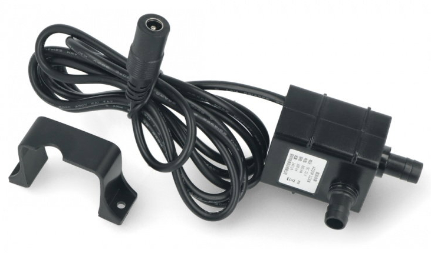
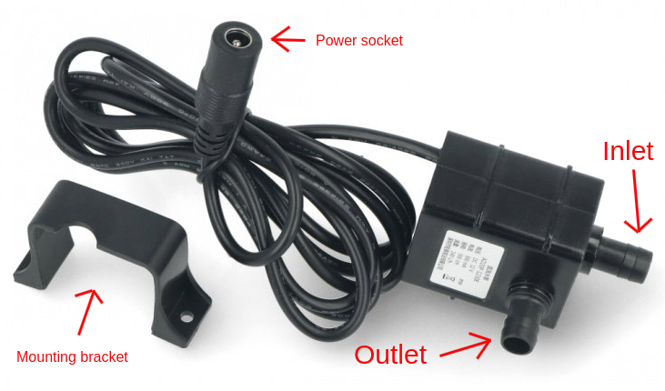

# AD20P-1230E pump

The AD20P-1230E is 12V submersible pump. It is used to water connected plants, 
with one pump per plant.

To function as expected it should either be submerged in the Plant Controllers
water tank.

## Connections

The inlet is on the end of the pump.

The outlet is on the side of the pump.

The power socket is on the end of the cord.

The pump might come with a mounting bracket.

