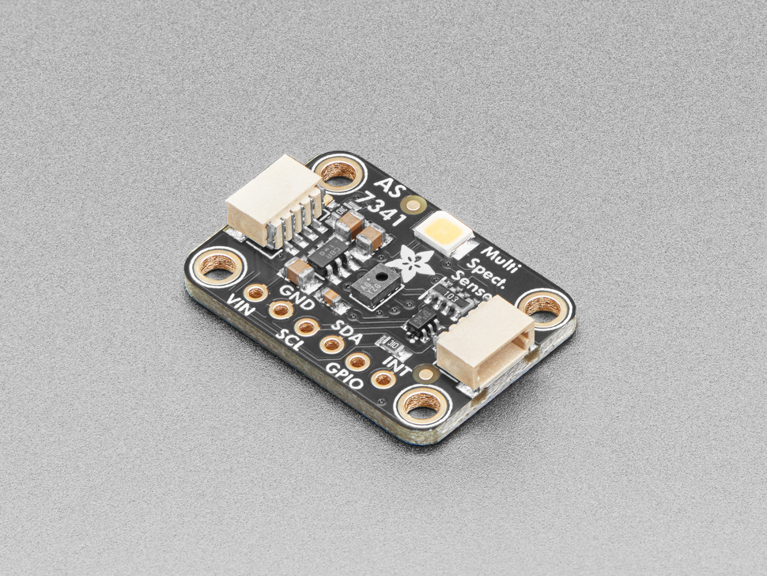

# Adafruit AS7341 10-channel light sensor
The AS7341 is a 10-channel light sensor, used to give rough spectral sensing of the ambient light sorrounding the plants controleld by the Plant Controller.

## Suppliers
The AS7341 can be purchased directly from [Adafruit](https://www.adafruit.com/product/4698).

## Positioning
Ensure that the sensor is located near the plants controlled by the Plant Controller, and that it isn't covered or shaded from the ambient light.