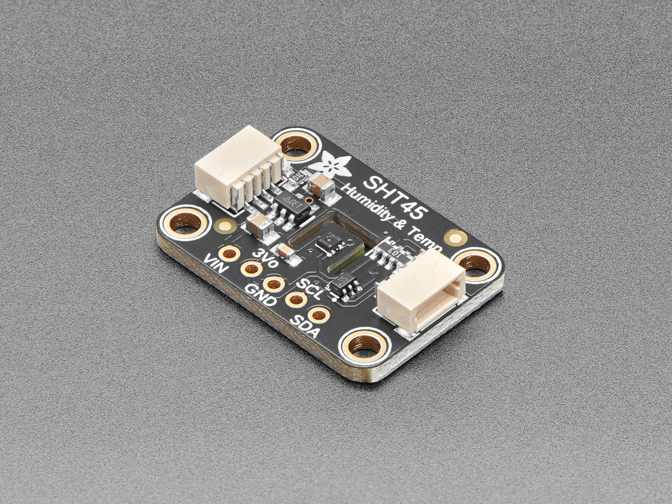

# Adafruit SHT45 air temperature and humidity sensor
The SHT45 is a air temperature and humidity sensor, used to sense the ambient temperature and humidity of the plants controlled by the Plant Controller.

## Suppliers
The SHT45 can be purchased directly from [Adafrit](https://www.adafruit.com/product/5665).

## Positioning
Ensure that the sensor is located close to the plants controlled by the Plant Controller, and shaded from hot light sources like sunlight or incandescent light bulbs.