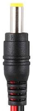

# 5.5/2.1mm Barrel Plug

To connect the [relay](./cs-io404.md) with the [pumps](./ad20p-1230e_pump.md) 
5.5/2.1mm barrel plugs are used.

These should be connected to suitable leads. Buying the plugs with leads 
attached should ensure proper connection. If bought without leads, 
ensure that the leads can handle a current of 300mA and a potential of 12V.