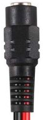

# 5.5/2.1mm Barrel Socket

To connect the [relay](./cs-io404.md) with the [power supply](./12v_1a_psu.md) 
a 5.5/2.1mm barrel socket is used.

This should be connected to suitable leads. Buying the socket with leads 
attached should ensure proper connection. If bought without leads, 
ensure that the leads can handle a current of 1A and a potential of 12V.