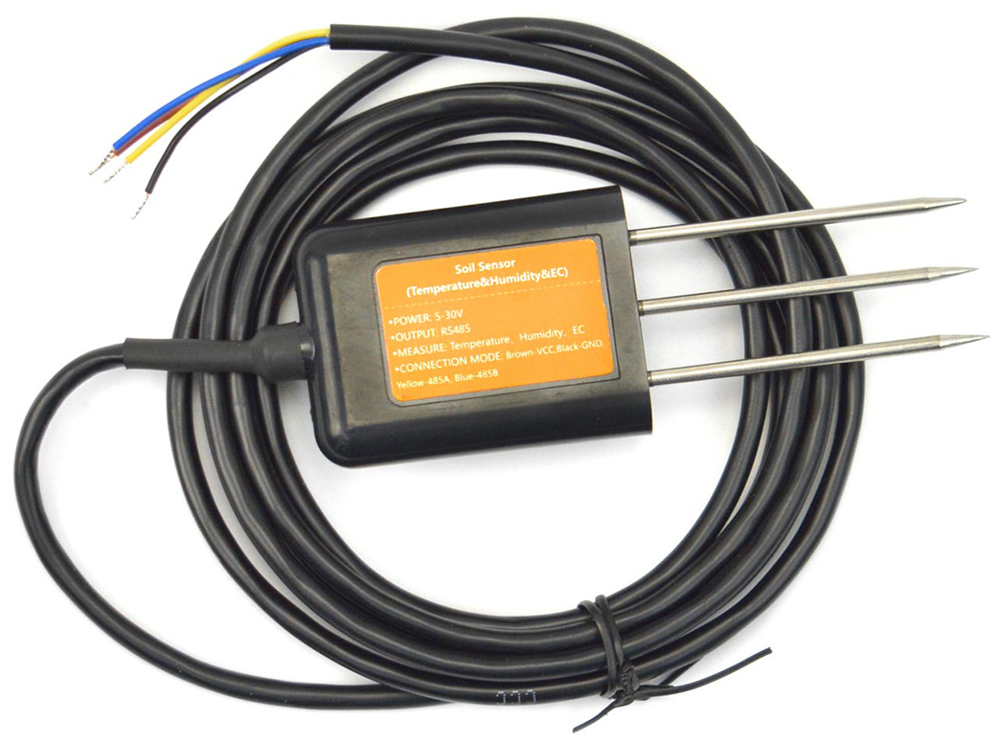

# RS485 Soil Sensor

This sensor measures temperature, moisture and electric conductivity of soil 
it is buried in. It is the recommended basic sensor for the Plant Controller.

It connects over RS485, and needs to be connected to the Plant Controllers
RS485 bus.

When connecting a newly bought sensor, make sure to change the sensors MODBUS 
address using the plant controllers setup utility. By default this address is
1, and it should be changed to something unique among connected MODBUS parts,
from 2 to 253.

## Suppliers
The sensor can be sourced at [DFRobot](https://www.dfrobot.com/product-2817.html)