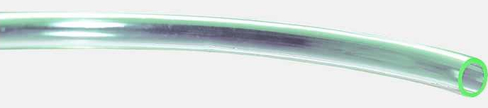

# Water tubing

To move water from the water tank to the plants, flexible VC tubing is used.
The tubing should be long enough to reach from the bottom of the water tank to
the connected plants. It should have an inner diameter of 8mm.

## Suppliers
Tubing should be available at most hardware stores.