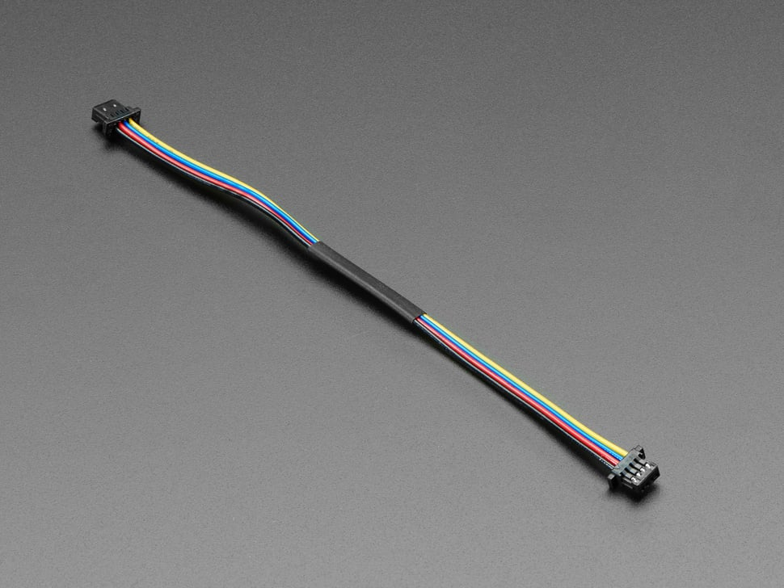

# STEMMA QT connector cable

To connect the Adafruits components to each other on the I2C line, STEMMA QT
cables are used. These are, in essence, four wires connected to JST-SH female 4-pin connectors,
and can be manually constructed with correct tools and components.

## Suppliers
The QT connector can be sourced at [Adafruits website](https://www.adafruit.com/product/4210),
or in other hobby component stores under names like STEMMA QT, Qwiic or simply JST-SH female 4-pin
to JST-SH female 4-pin cables.