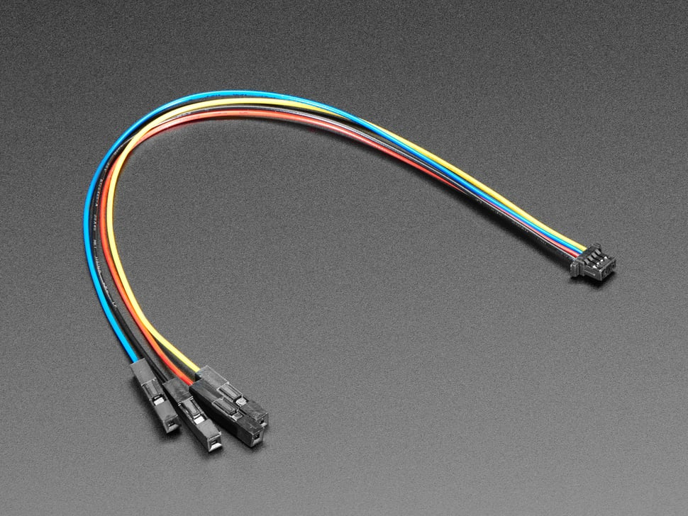

# QT to header sockets cable

This cable is used to connect the I2C component daisy chain to the Raspberry Pi's headers.

## Suppliers
The cable can be sourced from [Adafruits website](https://www.adafruit.com/product/4397),
or from other hobby component stores as STEAMM QT, Qwiic or JST SH 4-pin to header sockets cables.