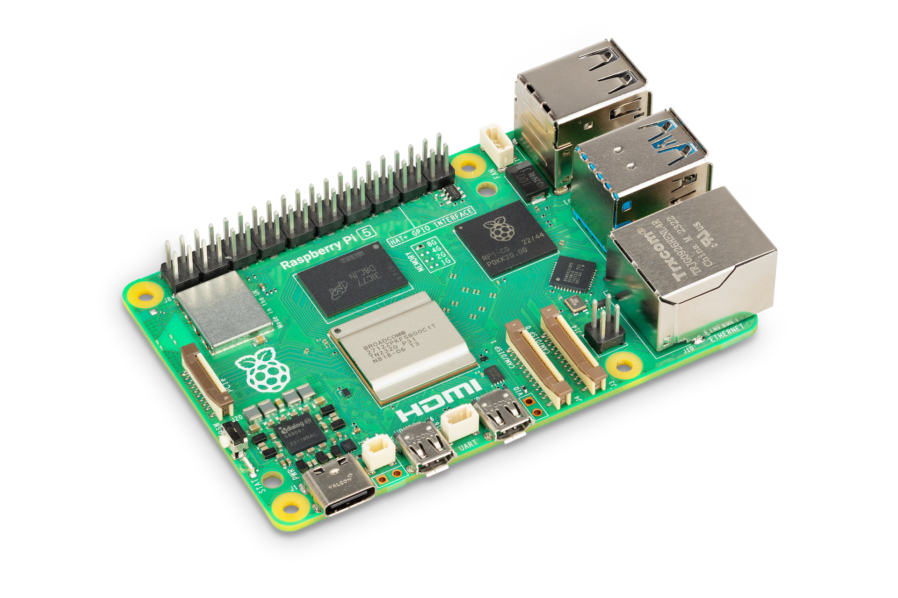
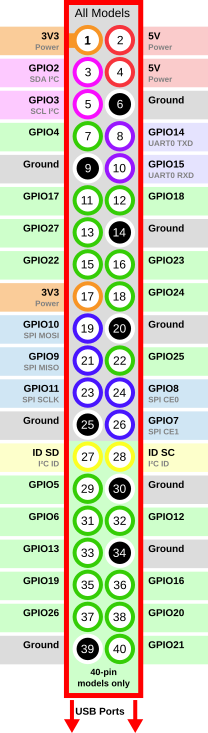

# Raspberry Pi 5
A single board computer with several peripheral options.
Used as the core of the plant Controller because of its more than adequate processing power and memory, its broad availability and its good documentation.

It is recommended to purchase a version with at least 4 GB ram.

## Suppliers
The Raspberry Pi 5 can be purchased directly from Raspberry Pi's [own website](https://www.raspberrypi.com/products/raspberry-pi-5/), or from a local reseller [approved](https://www.raspberrypi.com/resellers/) or otherwise.

## Pin layout
The arrows point towards the USB connections.
