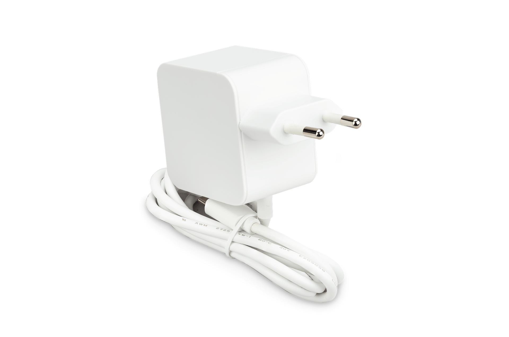

# Power Supply for Raspberry Pi 5
The [Raspberry Pi 5](rpi5.md) can be supplied with power in many ways. Raspberry Pi's own USB C power supply is the recommended option for the Plant Controller.

Make sure to that your version of the power supply has the correct wall socket type for your part of the world.

## Suppliers
The power supply can be purchased from Raspberry pi's [own website](https://www.raspberrypi.com/products/27w-power-supply/), or from a local reseller [approved](https://www.raspberrypi.com/resellers/) or otherwise.
