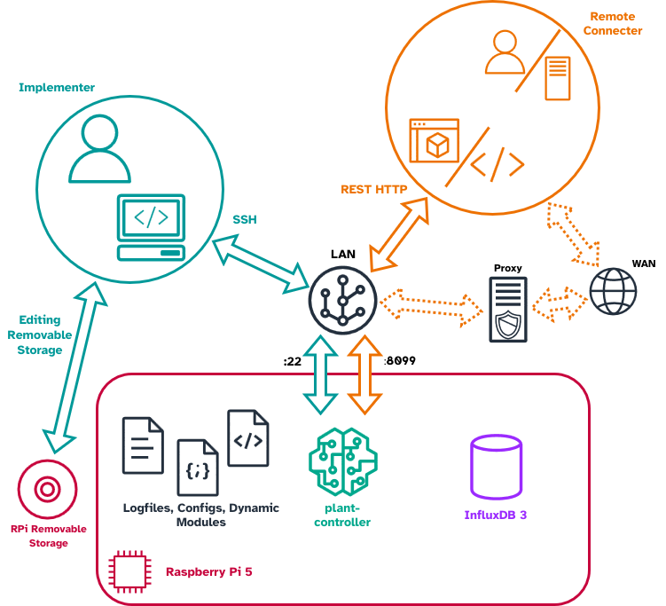

# Controller 3

Controller 3 (the PCtrl) is built around a Raspberry Pi 5 as its core
processing unit, with all hardware connected to it and all software installed
on it. The hardware is intended to be implementable by an electronics novice
with off-the-shelf hardware — for sourcing and putting it together, see the
[setup guide](setup/index.md). The software running on the controller is
documented in the [API Reference](../../api/plant_controller/index.md).

## Architecture

The hardware is logically divided into three groups — the **Controller**, the
**Actuators** and the **Sensor Suite**:

### Block descriptions

| **Block** | **Description** | **Components** |
|--|----|--|
| PCtrl | The full system | Sensorsuite, Actuators, Controller |
| Sensorsuite | Sensors for the surrounding greenhouse and connected plants. | I2C Sensor, MODBUS Sensor |
| I2C Sensor | Sensor connected through the PCtrl's I2C interface. | |
| Adafruit AS7341 Module | Module containing an AS7341 with an I2C interface. Measures light levels of the Greenhouse. | |
| Adafruit SHT45 Module | Module containing an SHT45 with an I2C interface. Measures air humidity and temperature of the Greenhouse. | |
| Multiplexed Soil Sensors | I2C based soil sensors. Measure the moisture level of connected plants. | TCA9548A I2C Multiplexer, Adafruit STEMMA Soil Sensor |
| TCA9548A I2C Multiplexer | I2C multiplexer. Used to connect multiple soil sensors with the same I2C address. | |
| Adafruit STEMMA Soil Sensor | Measures the moisture level of a connected plant. | |
| MODBUS Sensor | Sensor connected through the PCtrl's MODBUS interface. | |
| Actuators | Actuators for connected plants. | AD20P pump, 12V PSU, CS-IO404 |
| AD20P pump | Watering pump. Pumps water to connected plant for automatic watering. | |
| 12V PSU | 12V 1A power supply. Supplies the pumps and the CS-IO404. | |
| CS-IO404 | MODBUS connected relay module. Used to turn on or off the power to the pumps, initiating watering. | |
| Controller | The central control unit for the PCtrl. | USB to RS485, Raspberry Pi, RPi PSU |
| USB to RS485 | RS485 driver, used by the Raspberry Pi to communicate with MODBUS sensors and the CS-IO404. | |
| Raspberry Pi | Computing unit. Runs the PCtrl software and connects to all sensors and actuators. | |
| RPi PSU | Power supply for the Raspberry Pi. | |

## Design

The blocks are connected as shown in the internal block diagram. The I2C based
modules are connected in a daisy chain, terminating in a star configuration
for any STEMMA Soil Sensors. The MODBUS based modules sit on one bus from the
USB to RS485 module, although only the RS485 soil sensors are powered from the
bus (the CS-IO404 is instead powered by the 12V PSU). Blocks whose ports
include the letter *N* can be implemented multiple times or not at all.

### Connections

| Block | Port | Signal type | Comment |
|-------|------|-------------|---------|
| Raspberry Pi 5 | USB-C | USB PD | Power supply |
| Raspberry Pi 5 | WiFi | WiFi | Connection to LAN |
| Raspberry Pi 5 | pin1 | 3.3V | I2C VCC |
| Raspberry Pi 5 | pin9 | GND | I2C reference |
| Raspberry Pi 5 | pin3 | SDA | I2C signal |
| Raspberry Pi 5 | pin5 | SCL | I2C clock |
| Raspberry Pi 5 | USB | USB | MODBUS interface connection |
| RPi PSU | USB-C | USB PD | Power out |
| RPi PSU | In | 220V AC | Power in |
| USB to RS485 | USB | USB | Connection to Raspberry Pi 5 |
| USB to RS485 | 5V | 5V | MODBUS power |
| USB to RS485 | A+ | A+ | RS485 signal A |
| USB to RS485 | B- | B- | RS485 signal B |
| USB to RS485 | GND | GND | MODBUS ground |
| CS-IO404 | DC- | GND | Power ground |
| CS-IO404 | DC+ | 12V | Power VCC |
| CS-IO404 | DO *N* COM | 12V | Power VCC for relay connection *N* |
| CS-IO404 | A+ | A+ | RS485 signal A connection |
| CS-IO404 | B- | B- | RS485 signal B connection |
| CS-IO404 | DO *N* NO | 12V | Relay out for connection *N* |
| 12V PSU | VCC | 12V | Power VCC out |
| 12V PSU | GND | GND | Power GND out |
| 12V PSU | In | 220V AC | Power in |
| AD20P pump | VCC | 12V | Power VCC |
| AD20P pump | GND | GND | Power GND |
| AD20P pump | INLET | Water | Pump inlet |
| AD20P pump | OUTLET | Water | Pump outlet |
| DFRobot soil temp hum EC sensor | BRWN | 5V | Brown wire, power VCC |
| DFRobot soil temp hum EC sensor | YLW | A+ | Yellow wire, RS485 signal A |
| DFRobot soil temp hum EC sensor | BLUE | B- | Blue wire, RS485 signal B |
| DFRobot soil temp hum EC sensor | BLK | GND | Black wire, power GND |
| DFRobot soil temp hum EC sensor | TINES(1) | SOIL TEMP | Temperature of connected plant soil |
| DFRobot soil temp hum EC sensor | TINES(2) | SOIL EC | Electrical conductivity of connected plant soil |
| DFRobot soil temp hum EC sensor | TINES(3) | SOIL MOISTURE | Moisture of connected plant soil |
| Adafruit SHT45 Module | QT A VCC/GND/SDA/SCL | 3.3V/GND/SDA/SCL | I2C bus in |
| Adafruit SHT45 Module | SHT45 CHIP | TEMP, HUMIDITY | Temperature and humidity of greenhouse air |
| Adafruit SHT45 Module | QT B VCC/GND/SDA/SCL | 3.3V/GND/SDA/SCL | I2C bus out |
| Adafruit AS7341 Module | QT A VCC/GND/SDA/SCL | 3.3V/GND/SDA/SCL | I2C bus in |
| Adafruit AS7341 Module | AS7341 CHIP | LIGHT SPECTRUM | Ambient light of the greenhouse |
| Adafruit AS7341 Module | QT B VCC/GND/SDA/SCL | 3.3V/GND/SDA/SCL | I2C bus out |
| TCA9548A I2C Multiplexer | QT IN VCC/GND/SDA/SCL | 3.3V/GND/SDA/SCL | I2C bus in |
| TCA9548A I2C Multiplexer | QT PORT *N* VCC/GND/SDA/SCL | 3.3V/GND/SDA/SCL | I2C bus out to port *N* |
| Adafruit STEMMA Soil Sensor | STEMMA IN VCC/GND/SDA/SCL | 3.3V/GND/SDA/SCL | I2C bus in |

## Actor interface

The controller is used by two primary actors. The **Implementer** has physical
access to the controller and interacts with it through its operating system
(usually over SSH): editing config files, running the setup utility and
starting and stopping the software. The **Remote Connecter** — either a person
or a computer running a Digital Twin — interacts with the controller over
TCP/IP through the HTTP REST API exposed on port 8099.

