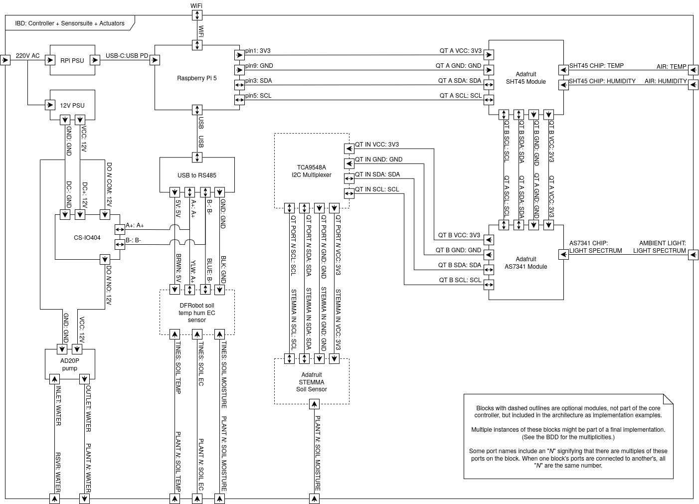
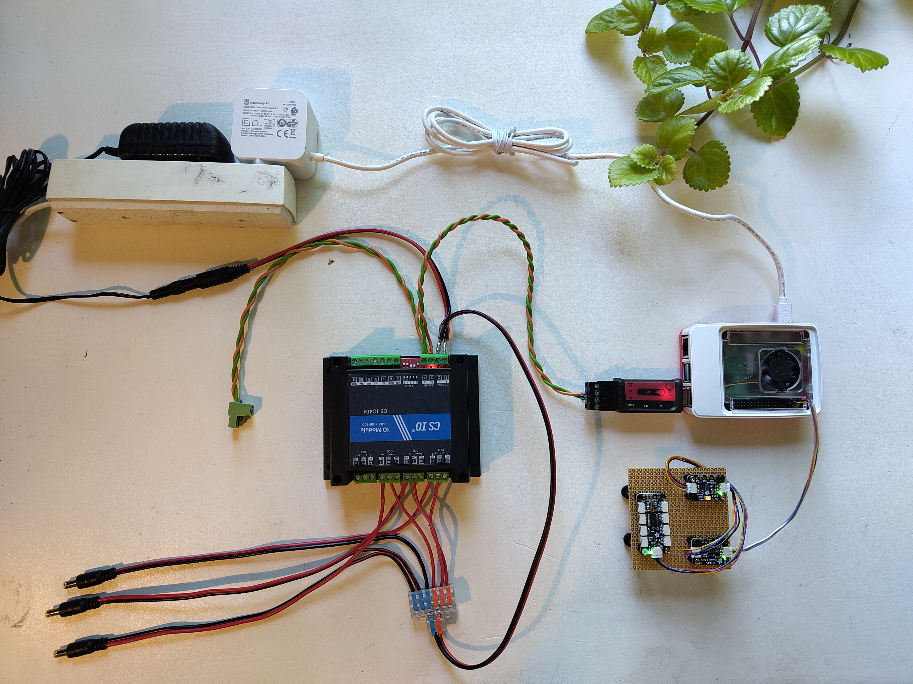

# Assembly

The controller's hardware is logically divided into three groups: the
**Controller** (Raspberry Pi, its PSU and the USB to RS485 dongle), the
**Actuators** (the CS-IO404 relay module, the 12V PSU and the pumps) and the
**Sensor Suite** (the greenhouse and plant sensors). This page walks through
connecting them; for the architecture, block descriptions and the full
port-by-port connection reference, see the
[hardware documentation](../index.md).

The diagram below shows all connections between the modules, and the photo
shows an assembled core.

This implementation should be seen as an example setup — the wiring should
follow the connections in the diagram, but the wires and connectors used can
be switched for whatever is most useful.

## The I2C bus (greenhouse and STEMMA sensors)

The I2C based modules are connected in a daisy chain, starting from the
Raspberry Pi's GPIO header and continuing from module to module:

1. Connect the STEMMA QT JST SH 4-pin cable to the Raspberry Pi's GPIO pins:
   3.3V to pin 1, GND to pin 9, SDA to pin 3 and SCL to pin 5.
2. Connect it to one of the SHT45 module's QT connectors.
3. Daisy chain from the SHT45 to the AS7341 with a 50 mm STEMMA QT cable.
4. If using STEMMA soil sensors: continue the chain from the AS7341 to the
   TCA9548A multiplexer, then connect each soil sensor to its own multiplexer
   port (a star configuration terminating the chain).

!!! note "QT, Qwiic, STEMMA and JST connectors"
    The connectors between the Adafruit modules are Adafruit "QT" connectors —
    small gauge wires with 4-pin JST SH connectors, also sold as "Qwiic"
    connectors. The STEMMA Soil Sensor's input, however, is a 4-pin JST **PH**
    connector (called a "STEMMA" connector by Adafruit), so each soil sensor
    needs a cable with JST SH in one end and JST PH in the other (such as the
    Sparkfun Qwiic to STEMMA cable in the [parts list](parts.md)).

## The RS485 MODBUS bus (relay and RS485 soil sensors)

The MODBUS based modules all sit on one bus from the USB to RS485 module:

1. Plug the USB to RS485 module into one of the Raspberry Pi's USB ports.
2. Run a twisted pair from the module's A+ and B- terminals; this pair is the
   bus. Connect A+ and B- to the corresponding terminals on the CS-IO404.
3. Connect any DFRobot RS485 soil sensors onto the bus by splitting the cable
   at any point and splicing the sensor's A+ (yellow) and B- (blue) leads onto
   the bus lines. The sensors' power leads (brown to 5V, black to GND) are
   connected to the USB to RS485 module's power terminals — the RS485 soil
   sensors are the only modules powered from the bus.

!!! warning "Signal integrity"
    The A+ and B- wires must be twisted together, otherwise signal integrity
    might be lost. It is also recommended, if not always strictly necessary,
    to add a 120 ohm resistor across each end of the bus — this becomes more
    important the longer the bus gets. In the photo above this is done in the
    output from the USB to RS485 dongle and at the green euroblock connector.

## Power and pumps

The CS-IO404 and the pumps are powered by the 12V PSU (not by the bus):

1. Connect the 12V PSU to the CS-IO404's DC+ and DC- terminals using the DC
   socket from the parts list.
2. For each pump *N*: wire 12V to the relay's DO *N* COM terminal, and wire
   the relay's DO *N* NO terminal and GND to the pump via the DC plug. Each
   relay channel thus switches the 12V supply to one pump.
3. Fit PVC tubing to each pump's outlet, and submerge the pump in the water
   tank. Route the tubing to the plant.

The barrel plugs/sockets can be omitted, but then the plugs from the 12V PSU
and pumps must be snipped off and wired directly into the CS-IO404. This is
not recommended, as it drastically reduces the reusability of the components
when the controller is no longer needed.

Finally, power the Raspberry Pi with its own 27W USB-C PSU.

---

With the hardware assembled, continue to the
[software installation](software.md).
