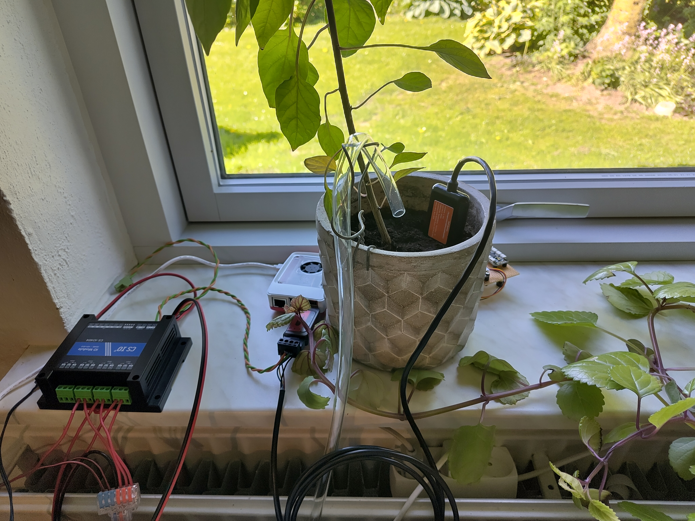

# Setting up Controller 3

Controller 3 (also referred to as the PCtrl) is a plant monitoring and watering
station built around a Raspberry Pi 5 and off-the-shelf, modular peripherals.
It is designed as an easily replicable Physical Twin test kit for research into
Digital Twins: each connected plant can be watered on a schedule or on demand,
and its parameters (along with those of the surrounding greenhouse) are
continuously measured, recorded and exposed over an HTTP REST API for Digital
Twins and modelers to consume.

The controller is intended to be implementable by an electronics novice using
only off-the-shelf hardware — no PCB design or (in the recommended
configuration) soldering is required. Initial implementation and setup of a
controller with two plants, each with one pump and one sensor, is expected to
take no more than 8 hours with all tools and components at hand.

## Setup overview

Setting up the controller consists of four steps:

1. **[Source your parts](parts.md)** — choose your configuration (number of
   plants, choice of soil sensors) and order the components.
2. **[Assemble the hardware](assembly.md)** — connect the sensors, relay
   module, pumps and Raspberry Pi.
3. **[Install the software](software.md)** — flash the operating system,
   install the database and the plant-controller program, and configure it for
   your plants.
4. **Calibrate and run** — use the built-in setup utility to calibrate pumps
   and sensors, then start the controller (covered at the end of the
   [software guide](software.md)).

## What you'll need

Beyond the parts in the [parts list](parts.md):

- A **secondary computer** for flashing the SD card and SSH'ing into the
  Raspberry Pi.
- An **SD card reader** connectable to the secondary computer (with a micro SD
  adapter if needed).
- A **LAN** (wired or WiFi) in which the Raspberry Pi and the secondary
  computer can reach each other. Alternatively, a USB-C cable can be used with
  the Raspberry Pi's "Gadget mode" for SSH over USB.
- Basic tools: wire stripper/cutter and a small screwdriver for terminal
  blocks. Wiring the RS485 bus involves splicing and twisting wires.

## Further documentation

- [Hardware documentation](../index.md) — architecture, block descriptions and
  the full port-by-port connection reference.
- [Software API Reference](../../../api/plant_controller/index.md) — reference
  documentation for the plant-controller Python package, generated from the
  source code.
