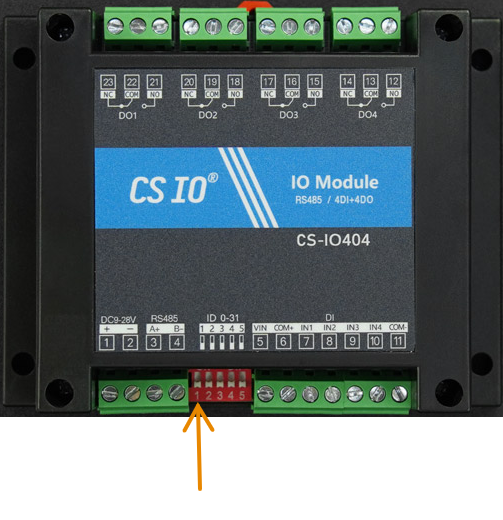

# Quick Start Guide

This guide walks through setting up a minimal, fully functional Plant
Controller on a dedicated **Raspberry Pi 5**, monitoring and controlling
**1 plant**. By the end you will have a working controller that measures
light, air temperature, humidity and soil conditions, waters the plant on a
schedule, and exposes all data over a web interface.

!!! note "Alternative setups"
    The Plant Controller can be set up to monitor and control multiple plants,
    using different sensors, and running on alternative hardware. If it's your
    first time setting up version 3 of the Plant Controller, it is advised to
    follow this quick start guide first. Guides for alternative setups can be
    found [here](custom_setups.md).

---

## 1. Requirements

You'll need an internet connection, and a trusted LAN that you can connect
both the controller and your extra installation computer to.

### Hardware

| Qty | Component |
|----:|-----------|
| 1 | [Raspberry Pi 5, at least 4 GB RAM](../documentation/hardware/components/rpi5.md) |
| 1 | [Raspberry Pi USB-C power supply](../documentation/hardware/components/rpipsu.md) |
| 1 | [Micro SD card, at least 128 GB](../documentation/hardware/components/sdcard.md) |
| 1 | [Adafruit AS7341 light sensor](../documentation/hardware/components/ada_as7341.md) |
| 1 | [Adafruit SHT45 air temperature and humidity sensor](../documentation/hardware/components/ada_sht45.md) |
| 1 | [DF-Robot soil sensor](../documentation/hardware/components/dfr_soil_sensor.md) |
| 1 | [CS-IO404 4-channel relay module](../documentation/hardware/components/cs-io404.md) |
| 1 | [USB to RS485 module](../documentation/hardware/components/usb_to_rs485.md) |
| 1 | [12V 1A power supply with 5.5/2.1 mm barrel plug connector](../documentation/hardware/components/12v_1a_psu.md) |
| 1 | [AD20P-1230E submersible pump](../documentation/hardware/components/ad20p-1230e_pump.md) |
| 1 | [5.5/2.1 mm barrel plug with 1 m leads](../documentation/hardware/components/barrel_plug.md) |
| 1 | [5.5/2.1 mm barrel socket with 1 m leads](../documentation/hardware/components/barrel_socket.md) |
| 2 | [120 Ohm resistors](../documentation/hardware/components/term_resistor.md) |
| 1 | [STEMMA QT cable](../documentation/hardware/components/qt_cable.md) |
| 1 | [STEMMA QT to JST SH 4-pin cable](../documentation/hardware/components/qt_to_jst.md) |
| 4 | Insulated wire, each a different color (this guide uses red, black, blue and yellow), length dependent on setup |
| 4 | [2 pole, 2-to-4 lever wire connectors](../documentation/hardware/components/lever_connector.md), or similar |
| 1 | [PVC tubing, length dependent on setup](../documentation/hardware/components/pvc_tubing.md) |
| 1 | [Water reservoir, for holding water for watering](../documentation/hardware/components/water_tank.md) |

### Software

- The Raspberry Pi Imager, available from [Raspberry Pi's website](https://www.raspberrypi.com/software/)

### Tools

- One extra computer for setup and testing, able to run the Raspberry Pi
  Imager, and preferably a browser and some way to run SSH. This guide assumes
  that the extra computer is running a Linux OS.
- A way to connect a micro SD card to the above computer, either via USB
  dongle or directly in a port on the computer.
- A small flat head screwdriver.
- A pair of cutters for cutting and stripping wire.
- A container capable of holding at least a liter of water.
- A measuring cup or similar, able to measure water in milliliters in at least
  10 ml increments.
- (Optionally, a screen and keyboard able to be connected to the Raspberry Pi.
  Unless you have complete trust and control over your LAN, this is advised.)
- (Optionally, a cordless drill for twisting wire.)

---

## 2. Install Raspberry Pi OS

Download the [Raspberry Pi Imager](https://www.raspberrypi.com/software/) to
the extra computer. (See their guide on
[how to use the installer](https://www.raspberrypi.com/documentation/computers/getting-started.html#imager-install),
if need be.)

Connect the micro SD card to the extra computer.

Run the Raspberry Pi Imager to start the installation process.

Choose **"Raspberry Pi 5"** as the device.

If you have the optional screen and keyboard for the Raspberry Pi, choose
**"Raspberry Pi OS (64-bit)"** for the OS. Otherwise choose
**"Raspberry Pi OS Lite (64-bit)"**.

Choose the connected micro SD card as the storage.

Customize your Raspberry Pi OS as desired, making sure to:

- choose a hostname for the Raspberry Pi (for example "plant-controller")
- choose your localization
- set a username and password
- input your LAN's Wi-Fi credentials (if you are not using a wired connection)
- enable SSH connectivity, if you DON'T have a screen and keyboard for the
  Raspberry Pi

!!! tip "No screen or keyboard?"
    If you can't connect to your Raspberry Pi through SSH over your LAN for
    some reason, enable **Raspberry Pi Connect**. This will allow you to
    connect to the Raspberry Pi over a USB connection instead.

Finally, set imager options and start writing the OS to the micro SD card.
This will erase all things previously stored on the micro SD card before
writing the OS and will take a couple of minutes.

When it is done, eject the micro SD card (if it hasn't already been ejected),
disconnect it from the computer, and insert it into the Raspberry Pi.

Boot up the Raspberry Pi (connecting the screen and keyboard to it beforehand
if available).

If you installed the Raspberry Pi OS with a desktop environment and have a
screen and keyboard connected to it, put away the extra computer; it won't be
needed for the rest of this guide. Then, open a terminal.

If you installed the Raspberry Pi OS Lite you'll have to connect to the
Raspberry Pi over SSH from the extra computer. In the future, when you are
instructed to open a new terminal, do it by SSH'ing in from the extra computer
in a new terminal.

From the terminal, ensure that the Raspberry Pi is updated by running:

```bash
sudo apt-get update -y && sudo apt-get upgrade -y
```

When everything is updated, continue to the next step.

---

## 3. Install the database

The controller uses **InfluxDB 3.0 or later** to store measurements and
watering events.

!!! warning "Raspberry Pi 5 page size"
    The default OS kernel for the Raspberry Pi 5 uses a memory page size of
    16k, but InfluxDB 3 assumes a page size of 4k. Before installing the
    database on a Raspberry Pi 5, switch to the 4k kernel by setting
    `kernel=kernel8.img` in `/boot/firmware/config.txt`:

    ```bash
    echo "kernel=kernel8.img" | sudo tee -a /boot/firmware/config.txt
    sudo shutdown -r now
    ```

    This reboots the Raspberry Pi and terminates any SSH connection to the
    machine — give it some time, then reconnect.

Install InfluxDB 3:

```bash
curl -O https://www.influxdata.com/d/install_influxdb3.sh \
&& sh install_influxdb3.sh
```

Choose the local install, and decline when the install script asks whether to
start the server at the end. Then start the server yourself:

```bash
influxdb3 serve --node-id node0
```

With the server running, open a new terminal (or SSH session) and create the
admin token:

```bash
influxdb3 create token --admin
```

Note the token down — it is referred to as `<ADMIN_TOKEN>` below, and is
needed in the controller's config file. Then create the database for the
controller:

```bash
influxdb3 create database --token <ADMIN_TOKEN> --retention-period 7d plant-controller
```

Here the retention period is set to 7 days to avoid gumming up the
controller's persistent storage, and the database name to `plant-controller`,
which is the default in the config file. Both can be changed freely, as long
as the config file is updated accordingly.

### Start InfluxDB automatically

To ensure the database starts automatically, create a systemd service:

```bash
sudo tee /etc/systemd/system/influxdb3.service > /dev/null << 'EOF'
[Unit]
Description=InfluxDB 3
After=network.target

[Service]
ExecStart=/usr/local/bin/influxdb3 serve --node-id node0
Restart=on-failure

[Install]
WantedBy=multi-user.target
EOF

sudo systemctl daemon-reload
sudo systemctl enable --now influxdb3
```

!!! note
    If `influxdb3` was installed to a different path, update the
    `ExecStart` line accordingly. You can find the path with
    `which influxdb3`.

---

## 4. Install the controller software

First, get the source code onto the Raspberry Pi, either by cloning it from
GitHub or by SCP'ing it over from the extra computer:

```bash
git clone https://github.com/DisasterlyDisco/plant-controller.git
```

In the following, `<src>` refers to the full path of the cloned repository.

Install pip and venv support:

```bash
sudo apt-get install -y python3-pip python3-venv python3-setuptools
```

Create a virtual environment (here in the home directory) and activate it:

```bash
cd ~
python -m venv .venv --system-site-packages
source .venv/bin/activate
```

### Install Adafruit Blinka

Adafruit Blinka provides the Python API for the Raspberry Pi's GPIO header,
which the controller uses for I2C communication with the Adafruit sensor
modules. It cannot simply be installed with pip, as it needs to configure the
machine itself — Adafruit supplies a convenience script:

```bash
cd ~
pip install --upgrade adafruit-python-shell
wget https://raw.githubusercontent.com/adafruit/Raspberry-Pi-Installer-Scripts/master/raspi-blinka.py
sudo -E env PATH=$PATH python3 raspi-blinka.py
```

### Install remaining Python dependencies

With Blinka installed, install the rest of the Python requirements as normal:

```bash
cd <src>/pt/controller_3
pip install -r requirements.txt
```

---

## 5. Assemble the hardware

Software installation will come with some waiting time — during these times it
is possible to assemble hardware not directly connected to the Raspberry Pi.

### 5.1 Connect the air sensors to the Raspberry Pi

Using the [STEMMA QT cable](../documentation/hardware/components/qt_cable.md),
connect the
[Adafruit AS7341 light sensor](../documentation/hardware/components/ada_as7341.md)
to the
[Adafruit SHT45 air temperature and humidity sensor](../documentation/hardware/components/ada_sht45.md).
It doesn't matter which of the two ports on the sensors are used.

Then, connect the
[STEMMA QT to JST SH 4-pin cable](../documentation/hardware/components/qt_to_jst.md)
to the final port on the
[Adafruit SHT45](../documentation/hardware/components/ada_sht45.md).

!!! warning "Power off first"
    Make sure the Raspberry Pi 5 is **POWERED OFF** before connecting anything
    to the GPIO header.

Connect the 4 JST pins of the
[STEMMA QT to JST SH 4-pin cable](../documentation/hardware/components/qt_to_jst.md)
to the Raspberry Pi's GPIO pins
([pin layout](../documentation/hardware/components/rpi5.md)), depending on
their color:

| GPIO Pin | Wire color |
|---------:|------------|
| Pin 1    | Red        |
| Pin 3    | Blue       |
| Pin 5    | Yellow     |
| Pin 9    | Black      |

### 5.2 Create the RS485 bus

Both the DF-Robot soil sensor and the CS-IO404 relay connect to the Raspberry
Pi via an RS485 bus wire pair. This bus wire pair is the primary way to connect
reliable peripherals to the plant controller.

Measure out how far away you want the relay from the Raspberry Pi, taking into
account that the 12V DC for the pump and relay must be connected near the
relay, and that the pump will be getting its power from the relay. Take this
length and multiply it by 1.5 for some slack — this will be the length of the
RS485 bus. As a minimum though, it should be at least 50 cm.

Take two lengths of insulated wire, one blue, the other yellow, cutting each
to be the length of the bus. Then, twist them together, tightly. (A cordless
drill is handy for this.)

Then, take two more lengths of insulated wire, one red, one black, cutting
them to be about 20 cm. Also twist these together, tightly.

Now, strip one end of each of the four wires, about 11 mm.

Connect these stripped wires to the
[USB to RS485 module](../documentation/hardware/components/usb_to_rs485.md),
dependent on color:

| Terminal | Wire color |
|----------|------------|
| GND      | Black      |
| B-       | Blue       |
| A+       | Yellow     |
| 5V       | Red        |

Then, connect a
[120 Ohm resistor](../documentation/hardware/components/term_resistor.md)
between B- and A+ in the USB to RS485 module. It might be necessary to trim
the resistor's legs to avoid it poking too far out.

With both twisted pairs connected to the USB to RS485 module, lay them out
side by side, and cut the yellow and blue pair so it is as long as the red and
black pair. Put the remaining yellow and blue pair aside for later.

Strip the other ends of each of the four wires, again about 11 mm.

Take two
[2 pole, 2-to-4 lever wire connectors](../documentation/hardware/components/lever_connector.md).

Connect the yellow and blue wires to the 2-connection side of the first
connector, blue to blue, yellow to orange.

Connect the red and black wires to the 2-connection side of the second
connector, black to blue, red to orange.

Now, take the
[DF-Robot soil sensor](../documentation/hardware/components/dfr_soil_sensor.md).
Connect it to the outer connectors of the 4-connector sides of the two lever
wire connectors, depending on the sensor's connector wires:

| Sensor wire | Connector | Slot   |
|-------------|-----------|--------|
| Blue        | First     | Blue   |
| Yellow      | First     | Orange |
| Black       | Second    | Blue   |
| Red         | Second    | Orange |

With the soil sensor connected, strip both ends of the remaining yellow and
blue wire pair that was previously set aside, again about 11 mm.

Connect one end to the remaining connections on the first lever wire connector,
blue to blue, yellow to orange.

Connect the other end to the
[CS-IO404 4-channel relay module](../documentation/hardware/components/cs-io404.md),
yellow to the terminal labelled A+, blue to the terminal labelled B-.

Connect a 120 Ohm resistor from the A+ to the B- terminals on the
CS-IO404 relay.

Finally, plug the USB end of the
[USB to RS485 module](../documentation/hardware/components/usb_to_rs485.md)
into one of the Raspberry Pi's USB ports.

### 5.3 Set the MODBUS address of the CS-IO404 relay

All devices connected over RS485 MODBUS have an address or device id that
identifies them. Usually, this is set to 1 as a factory default and must be
changed during setup to avoid addressing conflicts between devices.

To change the address of the CS-IO404 relay, use the dipswitches on the front.
These add to the address, dependent on their position — flipping the first
switch on adds 1, flipping the second adds 2, flipping the third adds 4,
flipping the fourth adds 8 and flipping the fifth adds 16.



Flip the first switch (indicated in the image above) up to the "on" position. This will result in a MODBUS address
of "2" for the CS-IO404.

### 5.4 Wire up the pump relay

Take the
[5.5/2.1 mm barrel socket](../documentation/hardware/components/barrel_socket.md)
and strip 11 mm off of the ends of the leads of the attached wires.

Connect these ends to the 2 connector side of a
[2 pole, 2-to-4 lever wire connector](../documentation/hardware/components/lever_connector.md),
black to blue and red to orange.

Cut two short lengths of red and black wire, no more than 10 cm, and strip
11 mm off of each end of each wire. Connect one end of each wire to the 4
connector side of the lever wire connector, again black to blue and red to
orange. Connect the other ends of the wires to the power terminals of the
CS-IO404 relay, black to "-" and red to "+".

Cut a length of red and a length of black wire long enough that it reaches from
the lever wire connector to about 4 cm beyond the opposite side of where the
power terminals are on the CS-IO404 relay. Strip these wires in both ends,
11 mm, and connect one end of each wire to the last two connectors of the lever
wire connector, again black to blue and red to orange.

Now take a new second 2 pole, 2-to-4 lever wire connector. Connect the other
ends of the red and black wires to the 2 connector side, black to blue, red to
orange.

Take a short length of red wire, strip the ends, and connect it between one of
the orange connectors on the 4 connector side and the COM terminal of relay DO1
on the CS-IO404 (also denoted as port 22).

Finally, strip 11 mm off of the ends of the wires of a
[5.5/2.1 mm barrel plug with 1 m leads](../documentation/hardware/components/barrel_plug.md),
connect the red wire to the NO terminal of relay DO1 on the CS-IO404 (also
denoted as port 21), and connect the black wire to the 4 connector side of the
lever wire connector, black to blue.

Power is supplied to the CS-IO404 and the pump by connecting the
[12V 1A power supply with 5.5/2.1 mm barrel plug connector](../documentation/hardware/components/12v_1a_psu.md)
to the barrel socket.

### 5.5 Set up the pump

The
[AD20P-1230E submersible pump](../documentation/hardware/components/ad20p-1230e_pump.md)
used for watering the connected plant is meant to be submersed in the system's
water tank. This system assumes that the water tank and pump inlet is placed at
a lower elevation than the plant, for example under the table that the plant is
located on.

Place the watering tank in its final location with respect to the plant.

Measure the distance from the bottom of the tank to the plant, and add some
extra slack. Cut some
[PVC tubing](../documentation/hardware/components/pvc_tubing.md) to this
length.

Attach one end of the tubing to the outlet of the pump.

Fix the other end of the tubing above the soil of the connected plant (physical
details of how are left as an exercise for the reader).

Connect the power socket of the pump to the barrel plug coming off of the
CS-IO404 relay.

Finally, lower the pump into the tank and fill the tank with water.

---

## 6. Configure the controller

Before use, the plant controller needs to be configured for the current setup.
Make sure that all hardware and software is installed before continuing.

### 6.1 Set up the config folder

All configuration lives in the `.plant_controller` subdirectory of the user's
home directory. Initialize it from the example implementation shipped with the
source code:

```bash
cp -r <src>/pt/controller_3/impl ~/.plant_controller
mv ~/.plant_controller/config.toml.example ~/.plant_controller/config.toml
```

### 6.2 Configure the database connection

Edit `~/.plant_controller/config.toml` and set the `token` value to the
`<ADMIN_TOKEN>` from earlier. If the database name, host or port differ from
the defaults (for instance if the database runs on another machine), update
them here too:

```toml
[database]
name = "plant-controller"
host = "http://127.0.0.1:8181"
token = "<ADMIN_TOKEN>"
```

### 6.3 Configure the connected plant

Each connected plant gets its own JSON file in
`~/.plant_controller/plants/`, declaring its sensors and its pump.
An example configuration made for this quick start is already included in the
config folder. Rename it, removing the `.example` suffix and replacing
`plant_name` with a useful identifier (`<PLANT_IDENTIFIER>`) for the connected
plant (note this name down for later):

```bash
mv ~/.plant_controller/plants/plant_name.json.example ~/.plant_controller/plants/<PLANT_IDENTIFIER>.json
```

Watering of the plant is done following a schedule. Watering schedules live in
`~/.plant_controller/pump_schedules/`, one JSON file per plant. This folder
comes with an example schedule just like the plant configuration. As with the
plant config, rename it, removing the `.example` suffix and replacing
`plant_name` with the previously chosen identifier, making sure that they are
the same:

```bash
mv ~/.plant_controller/pump_schedules/plant_name.json.example ~/.plant_controller/pump_schedules/<PLANT_IDENTIFIER>.json
```

### 6.4 Change the MODBUS address of the soil sensor

The connected
[soil sensor](../documentation/hardware/components/dfr_soil_sensor.md) has the
standard MODBUS address of 1 from the factory. This should be changed to avoid
address conflicts if adding more sensors in the future.

To do this, first disconnect the 12V DC power supply, and check that CS-IO404
is powered off (no lights on in the relay).

With that done, ensure that the InfluxDB database is running, starting it if
it isn't.

Then, in a separate terminal, source the previously set up Python virtual
environment and then start the plant_controller in setup mode:

```bash
source ~/.venv/bin/activate
cd <src>/pt/controller_3/src
python -m plant_controller setup
```

From within the setup utility, change the sensor address by writing
`<PLANT_IDENTIFIER>.soil.change_id` (substituting `<PLANT_IDENTIFIER>` for the
identifier previously chosen for the connected plant), hitting enter, and
following the guide as presented by the program.

If the id change was successful, exit the setup program, and reconnect power
to the CS-IO404 relay.

### 6.5 Calibrate the pump

The pump needs to be calibrated after installation to ensure proper water
dosage.

!!! warning
    The whole plant controller system should be in its final location and
    configuration before calibrating — moving pumps and pump outlets after
    calibration invalidates it.

In preparation, remove the plant from under the pump outlet, and replace it
with an empty vessel able to hold 1 liter of water.

When ready, make sure that the database is running and that the Python virtual
environment has been sourced, then start the plant_controller in setup mode:

```bash
source ~/.venv/bin/activate
cd <src>/pt/controller_3/src
python -m plant_controller setup
```

From here, start calibration by writing
`<PLANT_IDENTIFIER>.pump.calibrate` (substituting `<PLANT_IDENTIFIER>` for the
identifier previously chosen for the connected plant), hitting enter, and
following the on screen guide.

When the pump is sufficiently calibrated, replace the plant under the pump
outlet.

---

## 7. Run the controller

If all previous steps have been followed the controller should now be fully
functional. To run it, ensure that the Python virtual environment has been
sourced, then:

```bash
source ~/.venv/bin/activate
cd <src>/pt/controller_3/src
python -m plant_controller run
```

The controller now monitors and waters the connected plant, and the web
interface is accessible on port 8099 of the Raspberry Pi.

If connected to the Raspberry Pi over LAN, this interface can be found by
typing `<CONTROLLER_IP>:8099` in a browser from another computer on the same
LAN, where `<CONTROLLER_IP>` is the IP of the Raspberry Pi.

If running the Raspberry Pi with a desktop environment and a connected screen
and keyboard, the web interface is available from within the Raspberry Pi by
typing `localhost:8099` in the Raspberry Pi's browser.

## 8. Next steps
Setup auto start for the controller using [systemd](./auto_start.md).

Read sensor data from the plant using the [Web API](../documentation/software/web_api.md).

Change how the plant is watered by [updating the watering schedule](../documentation/software/watering_schedule.md).

Extend the plant controller to monitor and water [more plants](./adding_plants.md).

Extend the plant controllers sensing capabilities with [custom sensing modules](./custom_sensors.md).
