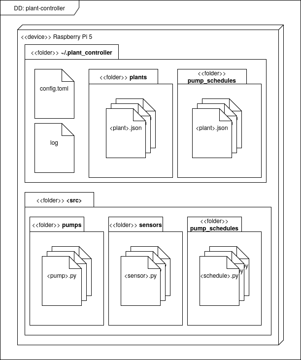
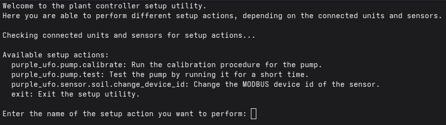

# Software installation

The controller software is a Python program (the `plant_controller` package)
which records measurements and watering events in an InfluxDB 3 database.
Both are installed on the Raspberry Pi in this guide, although the database
can also be hosted on another machine — especially recommended when running
the controller on older Raspberry Pis. The software has been tested on a
Raspberry Pi 5 with 4 GB RAM, and is functional on models as early as the
Raspberry Pi 3; a minimum of 2 GB RAM is recommended if the database runs on
the same machine.

For the design and API of the software itself, see the
[Software API Reference](../../../api/plant_controller/index.md).

## 1. Install the operating system

Connect the SD card to your secondary computer and flash the newest version of
**Raspberry Pi OS 64-bit Lite** (version Trixie or later) onto it. The easiest
way to do this is with the [Raspberry Pi Imager](https://www.raspberrypi.com/software/)
(version 2 recommended). In the imager, make sure that:

- SSH is enabled, and
- your WiFi is configured, if the Raspberry Pi must access your LAN
  wirelessly.

(If SSH over USB-C is needed instead, "Gadget mode" must also be enabled —
refer to online guides on Raspberry Pi 5 Gadget mode.)

Insert the SD card into the Raspberry Pi, boot it, SSH into it and ensure that
it is updated:

```bash
sudo apt-get update -y && sudo apt-get upgrade -y
```

## 2. Install the database

The controller uses **InfluxDB 3.0 or later** to store measurements and
watering events.

!!! warning "Raspberry Pi 5 page size"
    The default OS kernel for the Raspberry Pi 5 uses a memory page size of
    16k, but InfluxDB 3 assumes a page size of 4k. Before installing the
    database on a Raspberry Pi 5, switch to the 4k kernel by setting
    `kernel=kernel8.img` in `/boot/firmware/config.txt`:

    ```bash
    echo "kernel=kernel8.img" | sudo tee -a /boot/firmware/config.txt
    sudo shutdown -r now
    ```

    This reboots the Raspberry Pi and terminates the SSH connection — give it
    some time, then reconnect.

Install InfluxDB 3:

```bash
curl -O https://www.influxdata.com/d/install_influxdb3.sh \
&& sh install_influxdb3.sh
```

Choose the local install, and decline when the install script asks whether to
start the server at the end. Then start the server yourself:

```bash
influxdb3 serve --node-id node0
```

With the server running, create the admin token:

```bash
influxdb3 create token --admin
```

Note the token down — it is referred to as `<ADMIN_TOKEN>` below, and is
needed in the controller's config file. Then create the database for the
controller:

```bash
influxdb3 create database --token <ADMIN_TOKEN> --retention-period 7d plant-controller
```

Here the retention period is set to 7 days to avoid gumming up the
controller's persistent storage, and the database name to `plant-controller`,
which is the default in the config file. Both can be changed freely, as long
as the config file is updated accordingly.

!!! note
    The database server does not start automatically. Make sure
    `influxdb3 serve --node-id node0` is running whenever you run the
    controller — for example by running it in a detached terminal
    multiplexer session, or by setting it up as a systemd service.

## 3. Install the controller software

First, get the source code onto the Raspberry Pi, either by cloning it from
GitHub or by SCP'ing it over from the secondary computer:

```bash
git clone https://github.com/DisasterlyDisco/plant-controller.git
```

In the following, `<src>` refers to the full path of the cloned repository.

Install pip and venv support:

```bash
sudo apt-get install -y python3-pip python3-venv
sudo apt install --upgrade python3-setuptools
```

Create a virtual environment (here in the home directory) and activate it:

```bash
cd ~
python -m venv .venv --system-site-packages
source .venv/bin/activate
```

### Adafruit Blinka

Adafruit Blinka provides the Python API for the Raspberry Pi's GPIO header,
which the controller uses for I2C communication with the Adafruit sensor
modules. It cannot simply be installed with pip, as it needs to configure the
machine itself — Adafruit supplies a convenience script:

```bash
cd ~
pip install --upgrade adafruit-python-shell
wget https://raw.githubusercontent.com/adafruit/Raspberry-Pi-Installer-Scripts/master/raspi-blinka.py
sudo -E env PATH=$PATH python3 raspi-blinka.py
```

### Remaining dependencies

With Blinka installed, install the rest of the Python requirements as normal:

```bash
cd <src>/pt/controller_3
pip install -r requirements.txt
```

## 4. Configure the controller

All configuration lives in the `.plant_controller` subdirectory of the user's
home directory. Initialize it from the example implementation shipped with the
source code:

```bash
cp -r <src>/pt/controller_3/impl ~/.plant_controller
mv ~/.plant_controller/config.toml.example ~/.plant_controller/config.toml
```



### Main config

Edit `~/.plant_controller/config.toml` and set the `token` value to the
`<ADMIN_TOKEN>` from earlier. If the database name, host or port differ from
the defaults (for instance if the database runs on another machine), update
them here too:

```toml
[database]
name = "plant-controller"
host = "http://127.0.0.1:8181"
token = "<ADMIN_TOKEN>"
```

### Plant configs

Each connected plant gets its own JSON file in
`~/.plant_controller/plants/`, declaring its sensors and its pump. Rename and
adapt the shipped `plant1.json.example` to match your hardware — which sensor
driver module each sensor uses, the I2C addresses or multiplexer ports of
STEMMA sensors, and which relay channel the plant's pump is wired to.

### Pump schedules

Watering schedules live in `~/.plant_controller/pump_schedules/`, one JSON
file per plant (named `<plant_name>.json`), listing watering times and doses
in ml. Schedules can later be updated remotely through the controller's REST
API.

## 5. Calibrate

The controller includes an interactive setup utility for configuring and
calibrating the connected peripherals — most importantly pump calibration,
which ensures that a requested dose in ml translates to the correct pump
running time. Run it from the source directory:

```bash
cd <src>/pt/controller_3/src
python -m plant_controller setup
```



The available actions are defined by the configured peripherals; follow the
on-screen descriptions.

## 6. Run

With the database server running, start the controller:

```bash
cd <src>/pt/controller_3/src
python -m plant_controller run
```

The controller now monitors and waters the configured plants, and the web
interface is accessible on port 8099 of the Raspberry Pi. For the available
CLI options, run `python -m plant_controller --help`; for the REST API, see
the [web_api reference](../../../api/plant_controller/web_api.md).
