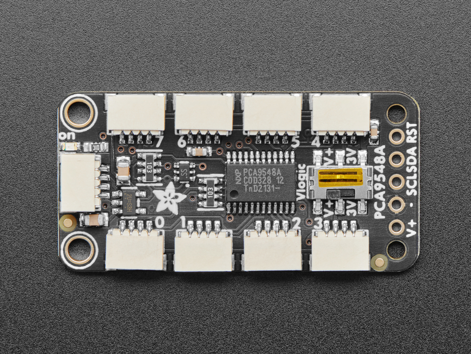

# Images of hardware parts

## Table of Contents

1. [Raspberry Pi 3 B+](#raspberry-pi-3-b)
2. [Pimoroni AutomationHAT](#pimoroni-automationhat)
3. [12V Submersible Water Pump (240L/h)](#12v-submersible-water-pump-240lh)
4. [Stackable T GPIO Header](#stackable-t-gpio-header)
5. [Adafruit Stemma 2.0 Soil Sensor](#adafruit-stemma-20-soil-sensor)
6. [Adafruit PCA9548 8-Channel STEMMA QT](#adafruit-pca9548-8-channel-stemma-qt)
7. [Adafruit SHT45 Temperature and Humidity Sensor](#adafruit-sht45-temperature-and-humidity-sensor)
8. [2A 72W Adjustable Power Supply (DC 3V ~ 36V)](#2a-72w-adjustable-power-supply-dc-3v--36v)
9. [I2C Qwiic Cable Kit Stemma QT](#i2c-qwiic-cable-kit-stemma-qt)
10. [2 in 6 Out Lever Compact Cable Connector](#2-in-6-out-lever-compact-cable-connector)
11. [18AWG DC 12V 5A 5.5 x 2.1 mm Male Female DC Power Pigtail Cable](#18awg-dc-12v-5a-55-x-21-mm-male-female-dc-power-pigtail-cable)
12. [M2.5 Nylon Screws Nuts Set](#m25-nylon-screws-nuts-set)

#### Hardware parts

##### Raspberry Pi 3 B+

##### Pimoroni AutomationHAT

##### 12V submersible water pump of 240L/h capacity

##### Stackeble T GPIO header

##### Adafruit Stemma 2.0 soil sensor

#### Adafruit PCA9548 8-Channel STEMMA QT

##### Adafruit SHT45 temperature and humidity sensor

##### 2A 72W Adjustable Power Supply DC 3V ~ 36V

##### I2C Qwiic Cable Kit Stemma QT

##### df 2 in 6 Out Lever, Compact Cable Connector

##### 18AWG DC 12V 5A 5.5 x 2.1 mm Male Female DC Power Pigtail Cable

##### M2.5 Nylon Screws Nuts Set, Black Nylon Spacer Screw Nuts phillips Scrw kit
