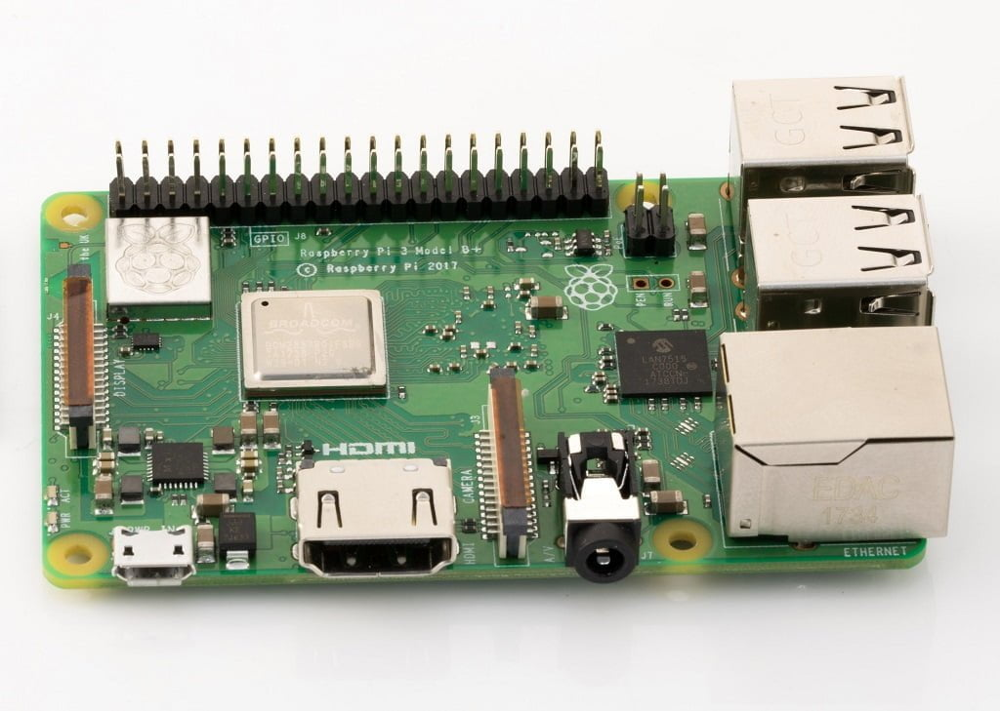

# Images of hardware parts

## Table of Contents

- [Images of hardware parts](#images-of-hardware-parts)
  - [Table of Contents](#table-of-contents)
    - [Hardware parts](#hardware-parts)
      - [Raspberry Pi 3 B+](#raspberry-pi-3-b)
      - [Pimoroni AutomationHAT](#pimoroni-automationhat)
      - [12V submersible water pump of 240L/h capacity](#12v-submersible-water-pump-of-240lh-capacity)
      - [Stackeble T GPIO header](#stackeble-t-gpio-header)
      - [Adafruit Stemma 2.0 soil sensor](#adafruit-stemma-20-soil-sensor)
      - [Adafruit PCA9548 8-Channel STEMMA QT](#adafruit-pca9548-8-channel-stemma-qt)
      - [Adafruit SHT45 temperature and humidity sensor](#adafruit-sht45-temperature-and-humidity-sensor)
      - [2A 72W Adjustable Power Supply DC 3V ~ 36V](#2a-72w-adjustable-power-supply-dc-3v--36v)
      - [I2C Qwiic Cable Kit Stemma QT](#i2c-qwiic-cable-kit-stemma-qt)
      - [df 2 in 6 Out Lever, Compact Cable Connector](#df-2-in-6-out-lever-compact-cable-connector)
      - [18AWG DC 12V 5A 5.5 x 2.1 mm Male Female DC Power Pigtail Cable](#18awg-dc-12v-5a-55-x-21-mm-male-female-dc-power-pigtail-cable)
      - [M2.5 Nylon Screws Nuts Set, Black Nylon Spacer Screw Nuts phillips Scrw kit](#m25-nylon-screws-nuts-set-black-nylon-spacer-screw-nuts-phillips-scrw-kit)
  - [References](#references)

### Hardware parts

#### Raspberry Pi 3 B+

[[1]](#references)

#### Pimoroni AutomationHAT

[[2]](#references)

#### 12V submersible water pump of 240L/h capacity

[[3]](#references)

#### Stackeble T GPIO header

[[4]](#references)

#### Adafruit Stemma 2.0 soil sensor

[[5]](#references)

#### Adafruit PCA9548 8-Channel STEMMA QT

[[6]](#references)

#### Adafruit SHT45 temperature and humidity sensor

[[7]](#references)

#### 2A 72W Adjustable Power Supply DC 3V ~ 36V

[[8]](#references)

You can also use a regular 12V DC power supply.

#### I2C Qwiic Cable Kit Stemma QT

[[9]](#references)

#### df 2 in 6 Out Lever, Compact Cable Connector

[[10]](#references)

#### 18AWG DC 12V 5A 5.5 x 2.1 mm Male Female DC Power Pigtail Cable

[[11]](#references)

#### M2.5 Nylon Screws Nuts Set, Black Nylon Spacer Screw Nuts phillips Scrw kit

[[12]](#references)

## References

[1]: [Raspberry Pi 3 Model B+](https://raspberrypi.dk/produkt/raspberry-pi-3-model-b-plus/)
[2]: [Pimoroni AutomationHAT](https://shop.pimoroni.com/products/automation-hat)
[3]: [12V Submersible Water Pump (240L/h)](https://arduinotech.dk/shop/12v-submersible-water-pump-240lh-vand-pumpe/)
[4]: [Stackable T GPIO Header](https://www.amazon.de/-/en/dp/B08C581XHV?ref=ppx_yo2ov_dt_b_fed_asin_title)
[5]: [Adafruit Stemma 2.0 Soil Sensor](https://www.amazon.de/-/en/dp/B07QH7RXBL?ref=ppx_yo2ov_dt_b_fed_asin_title)
[6]: [Adafruit PCA9548 8-Channel STEMMA QT](https://www.adafruit.com/product/5626)
[7]: [Adafruit SHT45 temperature and humidity sensor](https://www.adafruit.com/product/5665)
[8]: [2A 72W Adjustable Power Supply DC 3V ~ 36V](https://www.amazon.de/-/en/dp/B0DCV6SJ4C?ref=ppx_yo2ov_dt_b_fed_asin_title&th=1)
[9]: [I2C Qwiic Cable Kit Stemma QT](https://www.amazon.de/-/en/dp/B08HQ1VSVL?ref=ppx_yo2ov_dt_b_fed_asin_title)
[10]: [2 in 6 Out Lever Compact Cable Connector](https://www.amazon.de/-/en/dp/B0DDXK22W8?ref=ppx_yo2ov_dt_b_fed_asin_title&th=1)
[11]: [18AWG DC 12V 5A 5.5 x 2.1 mm Male Female DC Power Pigtail Cable](https://www.amazon.de/-/en/dp/B0CX44HTKZ?ref=ppx_yo2ov_dt_b_fed_asin_title)
[12]: [M2.5 Nylon Screws Nuts Set](https://www.amazon.de/-/en/dp/B0DCS5C7SN?ref=ppx_yo2ov_dt_b_fed_asin_title&th=1)