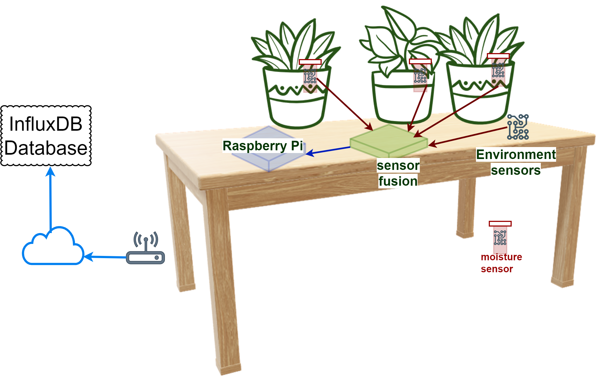

# Green House - I

The physical twin schematic for the green house is

Only three plants are being used right now.

The matching electrical schematic is:

The approach taken here is to use one good sensor for
each physical variable measurement.
All the sensors selected use [I2C communication protocol](https://www.nxp.com/docs/en/user-guide/UM10204.pdf).

There is only one I2C port on GPIO of Raspberry Pi 5.
An Adafruit
[PCA9548A multiplexer](https://learn.adafruit.com/adafruit-pca9548-8-channel-stemma-qt-qwiic-i2c-multiplexer)
setup is used to connect
multiple I2C sensors to the Raspberry Pi (RPi) 5.

It is useful to be familiar with the RPi 5 [GPIO pins](https://pinout.xyz/).
The I2C pins of RPi 5 are.

| Pin No | Pin Name | Suggested Wire Color |
|:---|:---|:---|
| 1 | 3.3 | RED |
| 2 or 4 | 5V | RED |
| 3 | SDA | BLUE |
| 5 | SCL | YELLOW |
| 6 or 9 | GND | BLACK |

The multiplexer can work with both 3.3V and 5V.
The Multiplexer is available at **I2C address x70** and it has 8 ports.

The three Adafruit soil capacitive sensors, temperature and humidity sensor (Adafruit SHT45)
and light sensor (Adafruit AS7341) are connected to the multiplexer.

Sometimes the soil moisture sensors seem faulty, but they work if
they are cleaned and reconnected.

The I2C addresses of the sensors used are:

| I2C Address | Device | Purpose | Multiplexer Ports | Notes |
|:---|:---|:---|:---|:---|
| 0x36 to 0x39 (with 0x36 as default) | capacitive soil sensor | measure soil moisture | ports 0 to 2 | the default addresses have not been modified |
| 0x44 | SHT45 | temperature and humidity sensor | 6 | |
| 0x39 | AS7341 | 6-channel 16-bit light sensor | 7 | this measures light in seven wavelengths |
| 0x70 to 0x77 (with x070 as default) | PCA9548 | 8-TO-1 multiplexer | directly connected to I2C port of Raspberry Pi 5 | the default address has not been modified |

See [I2C address directory](https://learn.adafruit.com/i2c-addresses/the-list)

 The sensors are connected to Adafruit
PCA9548A (8-ch multiplexer) as follows:

The connections to the ports are:

port 0,1 and 2 --> soil moisture sensors
port 6 --> SHT45 temperature and humidity sensor
port 7 --> AS7341 light sensor
