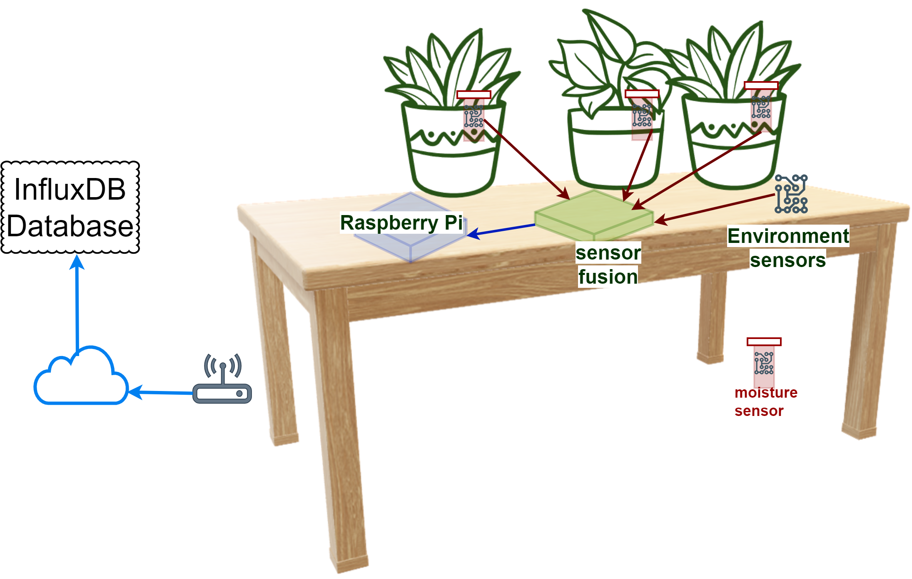
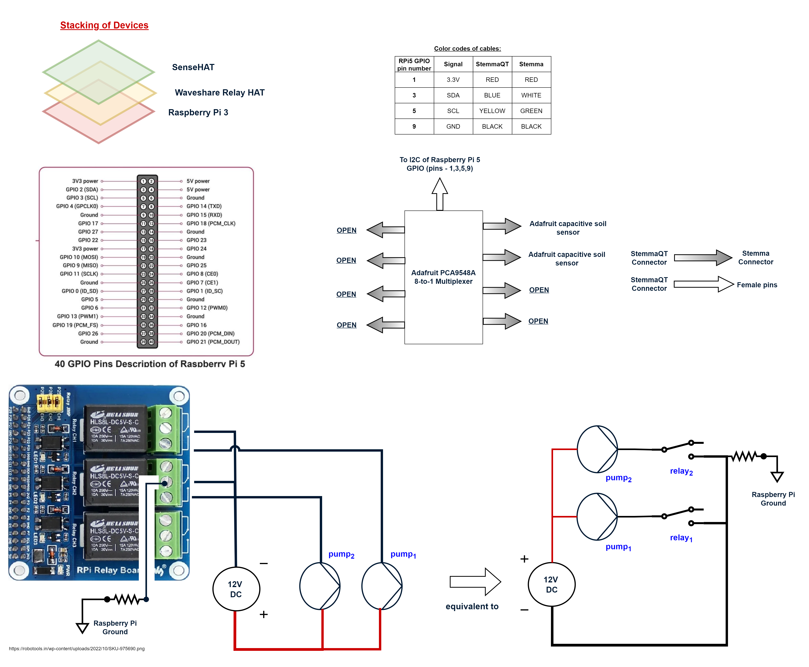

# Greenhouse - III

## Physical Setup

This greehouse uses SenseHAT for temperature, humidity and light
readings.
It uses [Waveshare 3-Channel Relay HAT](WAVESHARE_RELAY.md)
for controlling motors.

The physical twin schematic for the green house is



Only two plants are being used right now.

## Hardware Connections

The matching electrical schematic is:



The approach taken here is to use Raspberry Pi senseHAT for environment
readings and use Adafruit stemma soil sensors for moisture readings.

All the sensors selected use [I2C communication protocol](https://www.nxp.com/docs/en/user-guide/UM10204.pdf). Even the senseHAT uses I2C communication protocol underneath.
However, I2C is a bus protocol. So the Adafruit
[PCA9548A multiplexer](https://learn.adafruit.com/adafruit-pca9548-8-channel-stemma-qt-qwiic-i2c-multiplexer)
setup is used to connect
two soil moisture sensors to Raspberry Pi.

It is useful to be familiar with the RPi [GPIO pins](https://pinout.xyz/).
The I2C pins of RPi are.

| Pin No | Pin Name | Suggested Wire Color |
|:---|:---|:---|
| 1 | 3.3 | RED |
| 2 or 4 | 5V | RED |
| 3 | SDA | BLUE |
| 5 | SCL | YELLOW |
| 6 or 9 | GND | BLACK |

The multiplexer can work with both 3.3V and 5V.
The Multiplexer is available at **I2C address x70** and it has 8 ports.

Enable i2c interface in RPi OS configuration.

```bash
sudo raspi-config nonint do_i2c 0
```

You can check the list of I2C devices connected to a RPi using

```bash
sudo apt-get install i2c-tools
i2cdetect -y 1
```

The two Adafruit soil capacitive sensors are connected to the multiplexer.

Sometimes the soil moisture sensors seem faulty, but they work if
they are cleaned and reconnected.

The I2C addresses of the sensors used are:

| I2C Address | Device | Purpose | Multiplexer Ports | Notes |
|:---|:---|:---|:---|:---|
| 0x36 to 0x39 (with 0x36 as default) | capacitive soil sensor | measure soil moisture | ports 6 to 7 | the default addresses have not been modified |
| 0x5F | senseHAT (HTS221) | temperature and humidity sensor | | |
| 0x29 | senseHAT (TCS34725) | light sensor | | |
| 0x1C | senseHAT (LSM9DS1) | accelerometer | | |
| 0x6A | senseHAT (LSM9DS1) | accelerometer | | |
| 0x5C | senseHAT (LPS25H) | pressure sensor | | |
| 0x70 to 0x77 (with x070 as default) | PCA9548 | 8-TO-1 multiplexer | directly connected to I2C port of Raspberry Pi 3 | the default address has not been modified |

**missing I2C device:** x46 for senseHAT (LED2472G)

See [I2C address directory](https://learn.adafruit.com/i2c-addresses/the-list)

### Note

1. Accessing the I2C bus in parallel in two programs leads to errors. Use multiplexer for such a purpose.
1. The I2C bus communication may not be very robust.
   The sensors produce errors sometimes in an hour and sometimes in a day. So python exception checking is required.

## Run Controller

The programs store readings in InfluxDB database.

```bash
sudo apt-get install sense-hat
python -m venv .venv-sensehat
#update the venv config to include system-wide-packages, see
#https://stackoverflow.com/questions/55600132/installing-local-packages-with-python-virtualenv-system-site-packages#55600285
#in file vi .venv-sensehat/pyvenv.cfg
# include-system-site-packages = true
source .venv-sensehat/bin/activate
pip install influxdb_client
python sensehat.py
```

In another terminal, run controller script  for collecting
moisture readings and controlling the motors.
The moisture readings and motor status are stored in InfluxDB database.

```bash
python -m venv .venv-controller
source .venv-controller/bin/activate
pip install -r requirements.controller.txt
python controller-2.py
```
